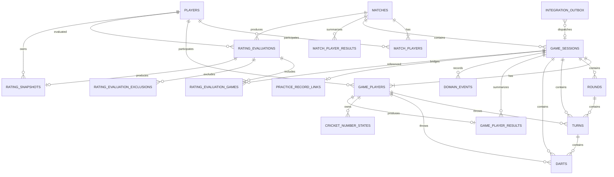

# DartsApp DB設計書

- 文書名: DartsApp DB設計書
- 文書バージョン: 1.0
- 作成日: 2026-07-12
- 対象リポジトリ: `ShijimiWORKs-sudo/shijimiworks-dartssuportapp`
- 対象アプリ: DartsApp（現行技術名: DartsSupportApp）
- 前提資料: `DartsApp_詳細設計書_v1.0.md`
- 対象DBバージョン: Game Database v1 / `PRAGMA user_version = 1`

---

## 1. 文書の目的

本書は、DartsAppへ追加するゲーム実行機能、投擲履歴、MATCH履歴、Rating連携基盤のデータベース設計を定義する。

対象範囲は次のとおり。

1. プレイヤー
2. MATCH
3. COUNT-UP / 01 / STANDARD CRICKETのゲームセッション
4. ROUND / TURN / DART
5. 途中保存・再開
6. Undo・訂正・監査履歴
7. ゲーム結果・統計
8. Rating評価候補・Ratingスナップショット
9. 既存AsyncStorageのPracticeRecordとの連携
10. migration、インデックス、トランザクション、整合性

Ratingの具体的な数式・閾値はRating計算モジュール仕様書で定義し、本書では保存形式と再計算境界を定義する。

---

## 2. 設計方針

### 2.1 保存方式

ゲーム領域の物理保存方式はSQLiteとし、Expo SDK 54に対応する`expo-sqlite`を使用する。

- DBファイル名: `dartsapp_games.db`
- 接続管理: `SQLiteProvider`
- DB初期化: `onInit`でmigration実行
- DBバージョン: `PRAGMA user_version`
- 書込みトランザクション: `withExclusiveTransactionAsync`
- ユーザー入力を含むSQL: バインドパラメータまたはPrepared Statement

初期実装ではSQLCipherを使用しない。Expo Goでの確認を維持し、端末自体の保護機能を前提とする。将来、Development Buildへ移行して暗号化を導入する場合は別migration・別リリース計画とする。

### 2.2 ハイブリッド保存

| データ                             | 正本                  | 方針                          |
| ---------------------------------- | --------------------- | ----------------------------- |
| 現行プロフィール                   | AsyncStorage AppState | 継続利用                      |
| UIテーマ・背景                     | AsyncStorage AppState | 継続利用                      |
| 練習フィルタ・お気に入り           | AsyncStorage AppState | 継続利用                      |
| ゲームの既定設定                   | AsyncStorage AppState | schemaVersion更新時に追加可能 |
| プレイヤー                         | SQLite                | 新規                          |
| MATCH / GAME / ROUND / TURN / DART | SQLite                | 新規                          |
| ゲーム統計                         | SQLite                | 新規                          |
| Rating評価・履歴                   | SQLite                | 新規                          |
| 既存分析用PracticeRecord           | AsyncStorage AppState | SQLiteのOutboxから連携        |

SQLiteとAsyncStorageをまたぐ単一トランザクションは作れないため、ゲーム完了時にSQLiteへOutboxを作成し、PracticeRecord反映を冪等に再試行する。

### 2.3 正規化とキャッシュ

投擲の正本は`darts`とする。ゲーム進行を高速に再開するため、次の現在値・集計値をキャッシュとして保持する。

- `game_sessions`の現在ラウンド、現在プレイヤー、状態
- `game_players`の残り点、CRICKET得点、累計得点
- `cricket_number_states`のマーク・CLOSE状態
- `game_player_results`の完了統計
- `match_player_results`のMATCH統計

訂正時は正本の投擲からキャッシュを再計算できることを必須とする。

### 2.4 IDと日時

- 主キー: UUID相当の衝突しにくい`TEXT`
- IDに`Date.now()`単体を使用しない
- 日時: UTCのISO 8601文字列（例: `2026-07-12T10:15:30.123Z`）
- ローカル表示時のみAsia/Tokyo等へ変換
- DB内の日時比較が必要な列は同一形式に統一

### 2.5 論理削除

通常のユーザー削除は論理削除とする。

- Player: `is_archived = 1`または匿名化
- Match / Game: `deleted_at`を設定
- Rating: 対象評価を`invalidated`にし再計算
- 物理削除: 開発用リセットまたは将来の完全削除機能のみ

過去MATCHのプレイヤー表示はスナップショット名を保持し、ゲスト匿名化後も履歴の整合性を維持する。

---

## 3. DB初期設定

DBを開いた直後、migrationより前に次を実行する。

```sql
PRAGMA journal_mode = WAL;
PRAGMA foreign_keys = ON;
PRAGMA synchronous = NORMAL;
PRAGMA busy_timeout = 5000;
```

### 3.1 採用理由

- WAL: 書込み中の読取り競合を抑える
- foreign_keys: SQLiteでは接続ごとに有効化が必要
- synchronous=NORMAL: WALとの組合せでモバイル用途の性能と耐障害性を両立
- busy_timeout: 短時間のロック競合を即時失敗にしない

### 3.2 DB接続数

初期版ではアプリ全体で1つの論理接続を共有する。Repositoryが独自にDBを開く構成は禁止する。

---

## 4. 命名規則・型規則

### 4.1 命名規則

- テーブル名: 複数形`snake_case`
- 列名: `snake_case`
- 主キー: `id`
- 外部キー: `<entity>_id`
- boolean: `INTEGER NOT NULL CHECK (... IN (0,1))`
- enum: `TEXT NOT NULL CHECK (... IN (...))`
- UTC日時: `<name>_at`
- 件数: `<name>_count`
- 1000倍の値: `<name>_milli`
- 10000分率: `<name>_bp`

### 4.2 数値精度

浮動小数誤差による表示差を避けるため、主要指標は整数スケールで保存する。

| 指標           |  保存例 | 意味   |
| -------------- | ------: | ------ |
| PPD            | `18450` | 18.450 |
| MPR            |  `2450` | 2.450  |
| 3DA            | `55350` | 55.350 |
| Rating         |    `82` | 8.2    |
| 信頼度         |  `6250` | 62.50% |
| 自動判定採用率 |  `8000` | 80.00% |
| 判定信頼度     |  `9200` | 92.00% |

画面表示時に変換する。計算モジュール内部でREALを使用してもよいが、永続化直前に規定の丸めを行う。

### 4.3 JSON列

JSONは、検索条件や整合性判定に使用しない補助情報だけに利用する。

採用例:

- 将来拡張用ゲーム設定
- イベントのbefore / after
- Rating計算内訳
- Outbox payload

主要な得点、勝敗、ステータス、評価可否は必ず専用列に保存する。

---

## 5. 論理ER図



---

## 6. テーブル一覧

| No. | テーブル                       | 種別             | 用途                              |
| --: | ------------------------------ | ---------------- | --------------------------------- |
|   1 | `db_migrations`                | 管理             | migration適用履歴                 |
|   2 | `players`                      | マスタ           | OWNER / GUEST                     |
|   3 | `matches`                      | トランザクション | 2人MATCHの親                      |
|   4 | `match_players`                | 関連             | MATCH参加者・表示スナップショット |
|   5 | `game_sessions`                | トランザクション | COUNT-UP / 01 / CRICKET           |
|   6 | `game_players`                 | 関連・現在値     | GAME参加者と進行中キャッシュ      |
|   7 | `rounds`                       | トランザクション | ROUND                             |
|   8 | `turns`                        | トランザクション | TURN                              |
|   9 | `darts`                        | 正本             | 1投                               |
|  10 | `cricket_number_states`        | 現在値           | CRICKET対象別状態                 |
|  11 | `domain_events`                | 監査             | 状態遷移・Undo・訂正イベント      |
|  12 | `game_player_results`          | 集計             | GAME完了時のプレイヤー別結果      |
|  13 | `match_player_results`         | 集計             | MATCH完了時のプレイヤー別結果     |
|  14 | `rating_evaluations`           | Rating           | MATCH別評価候補                   |
|  15 | `rating_evaluation_games`      | Rating関連       | 評価とGAMEの内訳                  |
|  16 | `rating_evaluation_exclusions` | Rating関連       | 除外理由                          |
|  17 | `rating_snapshots`             | Rating           | Rating履歴の正本                  |
|  18 | `integration_outbox`           | 連携             | AsyncStorage反映待ち              |
|  19 | `practice_record_links`        | 連携             | GAMEとPracticeRecordの一意リンク  |

---

## 7. テーブル詳細

## 7.1 `db_migrations`

migration適用履歴を保存する。`PRAGMA user_version`を現在バージョンの高速判定に使い、本テーブルを監査用に使う。

| 列           | 型      | NULL | 制約・説明        |
| ------------ | ------- | ---: | ----------------- |
| `version`    | INTEGER |   NO | PK                |
| `name`       | TEXT    |   NO | UNIQUE            |
| `checksum`   | TEXT    |   NO | SQL内容のハッシュ |
| `applied_at` | TEXT    |   NO | UTC               |

---

## 7.2 `players`

| 列              | 型      | NULL | 制約・説明                           |
| --------------- | ------- | ---: | ------------------------------------ |
| `id`            | TEXT    |   NO | PK、UUID                             |
| `player_type`   | TEXT    |   NO | `owner` / `guest`                    |
| `display_name`  | TEXT    |   NO | 1～30文字、trim後空文字禁止          |
| `throwing_hand` | TEXT    |   NO | `right` / `left` / `unknown`         |
| `color_key`     | TEXT    |  YES | UI識別子。色コードを直接必須にしない |
| `is_archived`   | INTEGER |   NO | 0 / 1                                |
| `created_at`    | TEXT    |   NO | UTC                                  |
| `updated_at`    | TEXT    |   NO | UTC                                  |
| `last_used_at`  | TEXT    |  YES | UTC                                  |
| `anonymized_at` | TEXT    |  YES | UTC                                  |

設計規則:

- 有効なOWNERは最大1件
- ゲスト削除は原則匿名化またはarchive
- 過去履歴からPLAYER行を物理削除しない

---

## 7.3 `matches`

MATCH全体の設定・状態・勝者を保持する。

| 列                             | 型      | NULL | 制約・説明                                                                    |
| ------------------------------ | ------- | ---: | ----------------------------------------------------------------------------- |
| `id`                           | TEXT    |   NO | PK                                                                            |
| `status`                       | TEXT    |   NO | `configured` / `in_progress` / `paused` / `completed` / `aborted` / `invalid` |
| `zero_one_start_score`         | INTEGER |   NO | 501 / 701                                                                     |
| `out_rule`                     | TEXT    |   NO | `single_out` / `master_out` / `double_out`                                    |
| `bull_rule`                    | TEXT    |   NO | `fat_bull` / `separate_bull`                                                  |
| `first_throw_player_id`        | TEXT    |  YES | FK `players`                                                                  |
| `current_game_no`              | INTEGER |   NO | 0～3                                                                          |
| `choice_game_mode`             | TEXT    |  YES | `zero_one` / `cricket`                                                        |
| `choice_selected_by_player_id` | TEXT    |  YES | FK `players`                                                                  |
| `choice_reason`                | TEXT    |  YES | 任意メモ                                                                      |
| `choice_selected_at`           | TEXT    |  YES | UTC                                                                           |
| `winner_player_id`             | TEXT    |  YES | FK `players`                                                                  |
| `loser_player_id`              | TEXT    |  YES | FK `players`                                                                  |
| `completion_reason`            | TEXT    |  YES | `match_decided`等                                                             |
| `manual_winner_reason`         | TEXT    |  YES | CORK等                                                                        |
| `aborted_by_player_id`         | TEXT    |  YES | FK `players`                                                                  |
| `abort_reason`                 | TEXT    |  YES | 任意メモ                                                                      |
| `row_version`                  | INTEGER |   NO | 楽観ロック、初期値0                                                           |
| `started_at`                   | TEXT    |  YES | UTC                                                                           |
| `paused_at`                    | TEXT    |  YES | UTC                                                                           |
| `completed_at`                 | TEXT    |  YES | UTC                                                                           |
| `created_at`                   | TEXT    |   NO | UTC                                                                           |
| `updated_at`                   | TEXT    |   NO | UTC                                                                           |
| `deleted_at`                   | TEXT    |  YES | 論理削除                                                                      |

`double_out`はDB型として予約するが、初期UIから開始不可とする。

---

## 7.4 `match_players`

MATCH参加者2名を保持し、名前変更・匿名化後も当時の表示を維持する。

| 列                      | 型      | NULL | 制約・説明                               |
| ----------------------- | ------- | ---: | ---------------------------------------- |
| `match_id`              | TEXT    |   NO | PK(複合)、FK `matches` ON DELETE CASCADE |
| `player_id`             | TEXT    |   NO | PK(複合)、FK `players`                   |
| `slot_no`               | INTEGER |   NO | 1 / 2、MATCH内UNIQUE                     |
| `display_name_snapshot` | TEXT    |   NO | MATCH開始時の名前                        |
| `player_type_snapshot`  | TEXT    |   NO | `owner` / `guest`                        |
| `games_won`             | INTEGER |   NO | キャッシュ、初期値0                      |
| `result`                | TEXT    |   NO | `pending` / `win` / `loss` / `no_result` |
| `created_at`            | TEXT    |   NO | UTC                                      |
| `updated_at`            | TEXT    |   NO | UTC                                      |

---

## 7.5 `game_sessions`

単独ゲームまたはMATCH内の1GAMEを表す。

| 列                         | 型      | NULL | 制約・説明                                                                         |
| -------------------------- | ------- | ---: | ---------------------------------------------------------------------------------- |
| `id`                       | TEXT    |   NO | PK                                                                                 |
| `match_id`                 | TEXT    |  YES | FK `matches` ON DELETE CASCADE                                                     |
| `match_game_no`            | INTEGER |  YES | 1～3                                                                               |
| `mode`                     | TEXT    |   NO | `count_up` / `zero_one` / `cricket` / 将来予約                                     |
| `status`                   | TEXT    |   NO | `draft` / `ready` / `in_progress` / `paused` / `completed` / `aborted` / `invalid` |
| `completion_reason`        | TEXT    |  YES | `normal` / `checkout` / `all_closed` / `round_limit`等                             |
| `max_rounds`               | INTEGER |   NO | COUNT-UP=8、01/CRICKET=15                                                          |
| `bull_rule`                | TEXT    |   NO | `fat_bull` / `separate_bull`                                                       |
| `out_rule`                 | TEXT    |  YES | 01のみ                                                                             |
| `zero_one_start_score`     | INTEGER |  YES | 301 / 501 / 701 / 901                                                              |
| `player_count`             | INTEGER |   NO | 1 / 2                                                                              |
| `current_round_no`         | INTEGER |   NO | 初期値1                                                                            |
| `current_turn_sequence_no` | INTEGER |   NO | 初期値0                                                                            |
| `current_player_id`        | TEXT    |  YES | FK `players`                                                                       |
| `winner_player_id`         | TEXT    |  YES | FK `players`                                                                       |
| `manual_winner_reason`     | TEXT    |  YES | 同点時等                                                                           |
| `rating_candidate`         | INTEGER |   NO | 0 / 1                                                                              |
| `config_json`              | TEXT    |   NO | 将来拡張、初期値`{}`                                                               |
| `row_version`              | INTEGER |   NO | 楽観ロック                                                                         |
| `started_at`               | TEXT    |  YES | UTC                                                                                |
| `paused_at`                | TEXT    |  YES | UTC                                                                                |
| `completed_at`             | TEXT    |  YES | UTC                                                                                |
| `aborted_at`               | TEXT    |  YES | UTC                                                                                |
| `created_at`               | TEXT    |   NO | UTC                                                                                |
| `updated_at`               | TEXT    |   NO | UTC                                                                                |
| `deleted_at`               | TEXT    |  YES | 論理削除                                                                           |

モード別制約:

- `count_up`: `max_rounds=8`、`player_count=1`
- 単独`zero_one`: `player_count=1`
- MATCH内`zero_one`: `player_count=2`
- 単独`cricket`: `player_count=1`
- MATCH内`cricket`: `player_count=2`
- `match_id IS NOT NULL`なら`match_game_no`必須
- `match_id IS NULL`なら`match_game_no`はNULL

---

## 7.6 `game_players`

GAME参加者と進行中の現在値キャッシュを保持する。

| 列                        | 型      | NULL | 制約・説明                                             |
| ------------------------- | ------- | ---: | ------------------------------------------------------ |
| `id`                      | TEXT    |   NO | PK                                                     |
| `game_id`                 | TEXT    |   NO | FK `game_sessions` ON DELETE CASCADE                   |
| `player_id`               | TEXT    |  YES | FK `players` ON DELETE SET NULL                        |
| `slot_no`                 | INTEGER |   NO | 1 / 2                                                  |
| `turn_order`              | INTEGER |   NO | 1 / 2                                                  |
| `display_name_snapshot`   | TEXT    |   NO | GAME開始時の名前                                       |
| `player_type_snapshot`    | TEXT    |   NO | `owner` / `guest`                                      |
| `starting_score`          | INTEGER |  YES | 01のみ                                                 |
| `current_remaining_score` | INTEGER |  YES | 01のみ                                                 |
| `current_total_score`     | INTEGER |   NO | COUNT-UP等、初期値0                                    |
| `current_cricket_score`   | INTEGER |   NO | 初期値0                                                |
| `darts_thrown`            | INTEGER |   NO | キャッシュ                                             |
| `turns_confirmed`         | INTEGER |   NO | キャッシュ                                             |
| `is_winner`               | INTEGER |   NO | 0 / 1                                                  |
| `result`                  | TEXT    |   NO | `pending` / `win` / `loss` / `completed` / `no_result` |
| `created_at`              | TEXT    |   NO | UTC                                                    |
| `updated_at`              | TEXT    |   NO | UTC                                                    |

一意制約:

- `UNIQUE(game_id, slot_no)`
- `UNIQUE(game_id, player_id)`。`player_id`がNULLの場合はスナップショットで履歴維持

---

## 7.7 `rounds`

| 列             | 型      | NULL | 制約・説明                                            |
| -------------- | ------- | ---: | ----------------------------------------------------- |
| `id`           | TEXT    |   NO | PK                                                    |
| `game_id`      | TEXT    |   NO | FK `game_sessions` ON DELETE CASCADE                  |
| `round_no`     | INTEGER |   NO | 1以上                                                 |
| `status`       | TEXT    |   NO | `in_progress` / `completed` / `terminated` / `voided` |
| `started_at`   | TEXT    |  YES | UTC                                                   |
| `completed_at` | TEXT    |  YES | UTC                                                   |
| `created_at`   | TEXT    |   NO | UTC                                                   |
| `updated_at`   | TEXT    |   NO | UTC                                                   |

`UNIQUE(game_id, round_no)`とする。

ゲームが第1プレイヤーのCHECKOUTで終了し、第2プレイヤーが投げない場合、そのROUNDは`terminated`で完了可能とする。

---

## 7.8 `turns`

| 列                      | 型      | NULL | 制約・説明                                                                            |
| ----------------------- | ------- | ---: | ------------------------------------------------------------------------------------- |
| `id`                    | TEXT    |   NO | PK                                                                                    |
| `game_id`               | TEXT    |   NO | FK `game_sessions` ON DELETE CASCADE                                                  |
| `round_id`              | TEXT    |   NO | FK `rounds` ON DELETE CASCADE                                                         |
| `game_player_id`        | TEXT    |   NO | FK `game_players` ON DELETE CASCADE                                                   |
| `turn_sequence_no`      | INTEGER |   NO | GAME内絶対順                                                                          |
| `round_no`              | INTEGER |   NO | 検索用冗長列                                                                          |
| `player_turn_order`     | INTEGER |   NO | ROUND内1 / 2                                                                          |
| `status`                | TEXT    |   NO | `in_progress` / `confirmed` / `bust` / `checkout` / `game_end` / `voided` / `invalid` |
| `start_remaining_score` | INTEGER |  YES | 01のみ                                                                                |
| `end_remaining_score`   | INTEGER |  YES | 01のみ                                                                                |
| `raw_score`             | INTEGER |   NO | 3投の実得点合計                                                                       |
| `applied_score`         | INTEGER |   NO | BUST時0                                                                               |
| `cricket_marks_total`   | INTEGER |   NO | TURN内有効マーク                                                                      |
| `cricket_points_scored` | INTEGER |   NO | TURN内加点                                                                            |
| `is_bust`               | INTEGER |   NO | 0 / 1                                                                                 |
| `is_checkout`           | INTEGER |   NO | 0 / 1                                                                                 |
| `dart_count`            | INTEGER |   NO | 0～3                                                                                  |
| `revision_no`           | INTEGER |   NO | 訂正ごとに加算                                                                        |
| `started_at`            | TEXT    |  YES | UTC                                                                                   |
| `confirmed_at`          | TEXT    |  YES | UTC                                                                                   |
| `created_at`            | TEXT    |   NO | UTC                                                                                   |
| `updated_at`            | TEXT    |   NO | UTC                                                                                   |

一意制約:

- `UNIQUE(game_id, turn_sequence_no)`
- `UNIQUE(round_id, game_player_id)`

---

## 7.9 `darts`

1投の現在有効な内容を保存する正本テーブル。

| 列                        | 型      | NULL | 制約・説明                                                            |
| ------------------------- | ------- | ---: | --------------------------------------------------------------------- |
| `id`                      | TEXT    |   NO | PK                                                                    |
| `game_id`                 | TEXT    |   NO | FK `game_sessions` ON DELETE CASCADE                                  |
| `turn_id`                 | TEXT    |   NO | FK `turns` ON DELETE CASCADE                                          |
| `game_player_id`          | TEXT    |   NO | FK `game_players` ON DELETE CASCADE                                   |
| `round_no`                | INTEGER |   NO | 1以上                                                                 |
| `dart_no`                 | INTEGER |   NO | 1～3                                                                  |
| `segment_number`          | INTEGER |  YES | 1～20。BULL / MISSはNULL                                              |
| `area`                    | TEXT    |   NO | `single` / `double` / `triple` / `outer_bull` / `inner_bull` / `miss` |
| `multiplier`              | INTEGER |   NO | 0 / 1 / 2 / 3                                                         |
| `score`                   | INTEGER |   NO | ルールから再計算した得点                                              |
| `cricket_marks`           | INTEGER |   NO | 0～3                                                                  |
| `input_source`            | TEXT    |   NO | `manual_segment`等                                                    |
| `detection_confidence_bp` | INTEGER |  YES | 0～10000                                                              |
| `candidate_id`            | TEXT    |  YES | 写真候補ID                                                            |
| `normalized_x`            | REAL    |  YES | 0～1                                                                  |
| `normalized_y`            | REAL    |  YES | 0～1                                                                  |
| `status`                  | TEXT    |   NO | `active` / `voided` / `invalidated`                                   |
| `is_rating_eligible`      | INTEGER |   NO | 0 / 1                                                                 |
| `correction_count`        | INTEGER |   NO | 初期値0                                                               |
| `client_action_id`        | TEXT    |   NO | 二重登録防止、UNIQUE                                                  |
| `confirmed_at`            | TEXT    |  YES | UTC                                                                   |
| `created_at`              | TEXT    |   NO | UTC                                                                   |
| `updated_at`              | TEXT    |   NO | UTC                                                                   |

入力由来:

- `manual_segment`
- `manual_board_point`
- `photo_detected`
- `photo_adjusted`
- `imported`
- `system_correction`

制約:

- `UNIQUE(turn_id, dart_no)`
- SINGLE / DOUBLE / TRIPLEは`segment_number BETWEEN 1 AND 20`
- BULL / MISSは`segment_number IS NULL`
- MISSは`multiplier=0 AND score=0`
- 得点は画面入力を信用せずドメインロジックで再計算

Undo時も行を削除せず、`status='voided'`へ変更する。Redo時は同一DARTを`active`へ戻すか、競合がある場合は新しいDARTとして追加しイベントへ関連を残す。

---

## 7.10 `cricket_number_states`

CRICKETの再開表示用キャッシュ。投擲から再生成可能とする。

| 列                   | 型      | NULL | 制約・説明                    |
| -------------------- | ------- | ---: | ----------------------------- |
| `game_id`            | TEXT    |   NO | PK(複合)、FK                  |
| `game_player_id`     | TEXT    |   NO | PK(複合)、FK                  |
| `target`             | TEXT    |   NO | PK(複合)、`20`～`15` / `BULL` |
| `marks_total`        | INTEGER |   NO | 0以上                         |
| `is_closed`          | INTEGER |   NO | 0 / 1                         |
| `closed_at_turn_id`  | TEXT    |  YES | FK `turns`                    |
| `closed_at_round_no` | INTEGER |  YES | 1以上                         |
| `points_scored`      | INTEGER |   NO | 当該target由来の累計得点      |
| `updated_at`         | TEXT    |   NO | UTC                           |

初期作成時、CRICKETの各`game_player`に対して7行を作る。

---

## 7.11 `domain_events`

状態変更・Undo・訂正を追跡するappend-only監査テーブル。

| 列                 | 型      | NULL | 制約・説明                  |
| ------------------ | ------- | ---: | --------------------------- |
| `id`               | TEXT    |   NO | PK                          |
| `scope_type`       | TEXT    |   NO | `match` / `game` / `rating` |
| `scope_id`         | TEXT    |   NO | 対象aggregate ID            |
| `match_id`         | TEXT    |  YES | 検索用                      |
| `game_id`          | TEXT    |  YES | 検索用                      |
| `sequence_no`      | INTEGER |   NO | scope内連番                 |
| `event_type`       | TEXT    |   NO | 下記イベント種別            |
| `entity_type`      | TEXT    |  YES | `dart` / `turn`等           |
| `entity_id`        | TEXT    |  YES | 対象ID                      |
| `client_action_id` | TEXT    |  YES | 冪等キー、UNIQUE            |
| `payload_json`     | TEXT    |   NO | before / after / reason等   |
| `created_at`       | TEXT    |   NO | UTC                         |

代表イベント:

- `match_created`
- `choice_selected`
- `game_created`
- `game_started`
- `dart_recorded`
- `dart_corrected`
- `dart_undone`
- `dart_redone`
- `turn_confirmed`
- `turn_reopened`
- `game_paused`
- `game_resumed`
- `game_completed`
- `game_aborted`
- `manual_winner_selected`
- `rating_evaluation_created`
- `rating_evaluation_invalidated`

`UNIQUE(scope_type, scope_id, sequence_no)`とする。

イベントは通常の画面表示用正本にはせず、監査・冪等性・デバッグ・訂正理由の保持に使う。

---

## 7.12 `game_player_results`

GAME完了時のプレイヤー別統計。進行中は作成しないか、`is_final=0`の一時結果として扱う。

| 列                         | 型      | NULL | 説明                                       |
| -------------------------- | ------- | ---: | ------------------------------------------ |
| `game_id`                  | TEXT    |   NO | PK(複合)、FK                               |
| `game_player_id`           | TEXT    |   NO | PK(複合)、FK                               |
| `player_id`                | TEXT    |  YES | 検索用、FK                                 |
| `result`                   | TEXT    |   NO | `win` / `loss` / `completed` / `no_result` |
| `rank_no`                  | INTEGER |  YES | 1以上                                      |
| `is_final`                 | INTEGER |   NO | 0 / 1                                      |
| `final_total_score`        | INTEGER |   NO | COUNT-UP等                                 |
| `final_remaining_score`    | INTEGER |  YES | 01                                         |
| `effective_score`          | INTEGER |   NO | 01の有効得点等                             |
| `rounds_count`             | INTEGER |   NO | 評価対象ラウンド                           |
| `turns_count`              | INTEGER |   NO | 確定TURN数                                 |
| `darts_thrown`             | INTEGER |   NO | 実投数                                     |
| `bull_count`               | INTEGER |   NO | 合計                                       |
| `inner_bull_count`         | INTEGER |   NO | 合計                                       |
| `outer_bull_count`         | INTEGER |   NO | 合計                                       |
| `triple_count`             | INTEGER |   NO | 合計                                       |
| `double_count`             | INTEGER |   NO | 合計                                       |
| `miss_count`               | INTEGER |   NO | 合計                                       |
| `bust_count`               | INTEGER |   NO | 01                                         |
| `checkout_flag`            | INTEGER |   NO | 0 / 1                                      |
| `checkout_round_no`        | INTEGER |  YES | 01                                         |
| `checkout_darts`           | INTEGER |  YES | 01                                         |
| `ppd_milli`                | INTEGER |  YES | 01                                         |
| `three_dart_average_milli` | INTEGER |  YES | 01                                         |
| `cricket_marks_total`      | INTEGER |   NO | CRICKET                                    |
| `mpr_milli`                | INTEGER |  YES | CRICKET                                    |
| `closed_number_count`      | INTEGER |   NO | 0～7                                       |
| `high_turn_score`          | INTEGER |  YES | 最高TURN                                   |
| `low_turn_score`           | INTEGER |  YES | 最低TURN                                   |
| `turns_100_plus`           | INTEGER |   NO | 01                                         |
| `turns_140_plus`           | INTEGER |   NO | 01                                         |
| `turns_180`                | INTEGER |   NO | 01                                         |
| `turns_5_marks_plus`       | INTEGER |   NO | CRICKET                                    |
| `turns_7_marks_plus`       | INTEGER |   NO | CRICKET                                    |
| `turns_9_marks`            | INTEGER |   NO | CRICKET                                    |
| `manual_correction_count`  | INTEGER |   NO | 訂正回数                                   |
| `auto_detected_darts`      | INTEGER |   NO | 入力品質                                   |
| `adjusted_darts`           | INTEGER |   NO | 入力品質                                   |
| `fully_manual_darts`       | INTEGER |   NO | 入力品質                                   |
| `auto_adoption_rate_bp`    | INTEGER |  YES | 0～10000                                   |
| `extra_stats_json`         | TEXT    |   NO | 初期値`{}`                                 |
| `calculation_version`      | INTEGER |   NO | 統計ロジック版                             |
| `created_at`               | TEXT    |   NO | UTC                                        |
| `updated_at`               | TEXT    |   NO | UTC                                        |

訂正後は同じPKを再計算してUPDATEし、`calculation_version`ではなく結果計算アルゴリズム版を保持する。データ訂正世代は`game_sessions.row_version`で追跡する。

---

## 7.13 `match_player_results`

| 列                                  | 型      | NULL | 説明                         |
| ----------------------------------- | ------- | ---: | ---------------------------- |
| `match_id`                          | TEXT    |   NO | PK(複合)、FK                 |
| `player_id`                         | TEXT    |   NO | PK(複合)、FK                 |
| `result`                            | TEXT    |   NO | `win` / `loss` / `no_result` |
| `games_won`                         | INTEGER |   NO | 0～2                         |
| `games_lost`                        | INTEGER |   NO | 0～2                         |
| `zero_one_game_count`               | INTEGER |   NO | 1～2                         |
| `zero_one_ppd_milli`                | INTEGER |  YES | 加重集計                     |
| `zero_one_three_dart_average_milli` | INTEGER |  YES | 加重集計                     |
| `cricket_game_count`                | INTEGER |   NO | 1～2                         |
| `cricket_mpr_milli`                 | INTEGER |  YES | 加重集計                     |
| `total_darts`                       | INTEGER |   NO | MATCH全体                    |
| `bull_count`                        | INTEGER |   NO | MATCH全体                    |
| `triple_count`                      | INTEGER |   NO | MATCH全体                    |
| `double_count`                      | INTEGER |   NO | MATCH全体                    |
| `bust_count`                        | INTEGER |   NO | MATCH全体                    |
| `manual_correction_count`           | INTEGER |   NO | MATCH全体                    |
| `auto_detected_darts`               | INTEGER |   NO | MATCH全体                    |
| `adjusted_darts`                    | INTEGER |   NO | MATCH全体                    |
| `fully_manual_darts`                | INTEGER |   NO | MATCH全体                    |
| `auto_adoption_rate_bp`             | INTEGER |  YES | 0～10000                     |
| `created_at`                        | TEXT    |   NO | UTC                          |
| `updated_at`                        | TEXT    |   NO | UTC                          |

---

## 7.14 `rating_evaluations`

MATCH完了または訂正後に、プレイヤーごとに1件作成する。訂正時は旧レコードを上書きせず、新しい`source_revision`で作成して旧評価を`invalidated`にする。

| 列                    | 型      | NULL | 説明                                                            |
| --------------------- | ------- | ---: | --------------------------------------------------------------- |
| `id`                  | TEXT    |   NO | PK                                                              |
| `match_id`            | TEXT    |   NO | FK                                                              |
| `player_id`           | TEXT    |   NO | FK                                                              |
| `source_revision`     | INTEGER |   NO | MATCH評価世代                                                   |
| `status`              | TEXT    |   NO | `pending` / `eligible` / `excluded` / `applied` / `invalidated` |
| `candidate_flag`      | INTEGER |   NO | 0 / 1                                                           |
| `match_result`        | TEXT    |   NO | `win` / `loss`                                                  |
| `zero_one_game_count` | INTEGER |   NO | 1～2                                                            |
| `zero_one_ppd_milli`  | INTEGER |  YES | 評価入力集計                                                    |
| `cricket_game_count`  | INTEGER |   NO | 1～2                                                            |
| `cricket_mpr_milli`   | INTEGER |  YES | 評価入力集計                                                    |
| `total_darts`         | INTEGER |   NO | 品質入力                                                        |
| `auto_detected_darts` | INTEGER |   NO | 品質入力                                                        |
| `adjusted_darts`      | INTEGER |   NO | 品質入力                                                        |
| `fully_manual_darts`  | INTEGER |   NO | 品質入力                                                        |
| `correction_count`    | INTEGER |   NO | 品質入力                                                        |
| `input_payload_json`  | TEXT    |   NO | 標準化されたRatingEvaluationInput                               |
| `created_at`          | TEXT    |   NO | UTC                                                             |
| `evaluated_at`        | TEXT    |  YES | UTC                                                             |
| `applied_at`          | TEXT    |  YES | UTC                                                             |
| `invalidated_at`      | TEXT    |  YES | UTC                                                             |

`UNIQUE(match_id, player_id, source_revision)`とする。

---

## 7.15 `rating_evaluation_games`

| 列                         | 型      | NULL | 説明                           |
| -------------------------- | ------- | ---: | ------------------------------ |
| `evaluation_id`            | TEXT    |   NO | PK(複合)、FK ON DELETE CASCADE |
| `game_id`                  | TEXT    |   NO | PK(複合)、FK                   |
| `mode`                     | TEXT    |   NO | `zero_one` / `cricket`         |
| `game_no`                  | INTEGER |   NO | MATCH内1～3                    |
| `ppd_milli`                | INTEGER |  YES | 01                             |
| `three_dart_average_milli` | INTEGER |  YES | 01                             |
| `mpr_milli`                | INTEGER |  YES | CRICKET                        |
| `darts_thrown`             | INTEGER |   NO | 投数                           |
| `rounds_count`             | INTEGER |   NO | ラウンド数                     |
| `checkout_flag`            | INTEGER |   NO | 0 / 1                          |
| `bust_count`               | INTEGER |   NO | 01                             |
| `marks_total`              | INTEGER |   NO | CRICKET                        |
| `created_at`               | TEXT    |   NO | UTC                            |

---

## 7.16 `rating_evaluation_exclusions`

| 列              | 型   | NULL | 説明                           |
| --------------- | ---- | ---: | ------------------------------ |
| `evaluation_id` | TEXT |   NO | PK(複合)、FK ON DELETE CASCADE |
| `reason_code`   | TEXT |   NO | PK(複合)                       |
| `detail`        | TEXT |  YES | ユーザー表示用補足             |
| `created_at`    | TEXT |   NO | UTC                            |

初期コード:

- `match_not_completed`
- `invalid_player_count`
- `invalid_game_structure`
- `missing_zero_one_result`
- `missing_cricket_result`
- `missing_winner`
- `unconfirmed_dart`
- `corrupt_throw_data`
- `aborted_game`
- `unsupported_input_source`
- `manual_result_decision_requires_review`

完全手動入力を除外するかはRating仕様書で確定するため、初期DBでは由来情報を保持し、コードを予約する。

---

## 7.17 `rating_snapshots`

Rating計算結果の履歴正本。過去値を上書きしない。

| 列                           | 型      | NULL | 説明                                                                                               |
| ---------------------------- | ------- | ---: | -------------------------------------------------------------------------------------------------- |
| `id`                         | TEXT    |   NO | PK                                                                                                 |
| `player_id`                  | TEXT    |   NO | FK                                                                                                 |
| `evaluation_id`              | TEXT    |  YES | UNIQUE、FK                                                                                         |
| `previous_snapshot_id`       | TEXT    |  YES | FK self                                                                                            |
| `measurement_status`         | TEXT    |   NO | `unmeasured` / `provisional_1_of_3` / `provisional_2_of_3` / `provisional` / `standard` / `stable` |
| `rating_tenths`              | INTEGER |  YES | 1.0～18.0なら10～180                                                                               |
| `confidence_bp`              | INTEGER |   NO | 0～10000                                                                                           |
| `evaluated_match_count`      | INTEGER |   NO | 累計採用MATCH                                                                                      |
| `window_match_count`         | INTEGER |   NO | 現在の計算窓、最大10想定                                                                           |
| `zero_one_index_milli`       | INTEGER |  YES | 計算内訳                                                                                           |
| `cricket_index_milli`        | INTEGER |  YES | 計算内訳                                                                                           |
| `match_index_milli`          | INTEGER |  YES | 計算内訳                                                                                           |
| `stability_adjustment_milli` | INTEGER |  YES | 計算内訳                                                                                           |
| `continuity_bonus_milli`     | INTEGER |  YES | 計算内訳                                                                                           |
| `calculation_version`        | INTEGER |   NO | Ratingロジック版                                                                                   |
| `calculation_detail_json`    | TEXT    |   NO | 重み・窓・丸め等                                                                                   |
| `created_at`                 | TEXT    |   NO | UTC                                                                                                |
| `invalidated_at`             | TEXT    |  YES | 訂正・削除による無効化                                                                             |

現在Ratingは、対象プレイヤーの`invalidated_at IS NULL`で最新の`created_at`を取得する。

---

## 7.18 `integration_outbox`

SQLiteとAsyncStorageの連携を安全に行うためのOutbox。

| 列                   | 型      | NULL | 説明                                                                       |
| -------------------- | ------- | ---: | -------------------------------------------------------------------------- |
| `id`                 | TEXT    |   NO | PK                                                                         |
| `event_type`         | TEXT    |   NO | `practice_record_upsert` / `practice_record_delete` / `rating_recalculate` |
| `aggregate_type`     | TEXT    |   NO | `game` / `match` / `player`                                                |
| `aggregate_id`       | TEXT    |   NO | 対象ID                                                                     |
| `idempotency_key`    | TEXT    |   NO | UNIQUE                                                                     |
| `payload_json`       | TEXT    |   NO | 連携payload                                                                |
| `status`             | TEXT    |   NO | `pending` / `processing` / `completed` / `failed`                          |
| `attempt_count`      | INTEGER |   NO | 初期値0                                                                    |
| `available_at`       | TEXT    |   NO | 再試行可能日時                                                             |
| `last_error_code`    | TEXT    |  YES | 技術詳細を限定保存                                                         |
| `last_error_message` | TEXT    |  YES | 個人情報を含めない                                                         |
| `created_at`         | TEXT    |   NO | UTC                                                                        |
| `updated_at`         | TEXT    |   NO | UTC                                                                        |
| `processed_at`       | TEXT    |  YES | UTC                                                                        |

処理ルール:

1. GAME完了トランザクション内でOutboxをINSERT
2. トランザクション完了後にProcessorが取得
3. AsyncStorageへPracticeRecordをupsert
4. `practice_record_links`を登録
5. Outboxを`completed`
6. 失敗時は`pending`または`failed`として再試行

`processing`のまま一定時間経過した行は、アプリ再起動時に`pending`へ戻す。

---

## 7.19 `practice_record_links`

同一GAMEからPracticeRecordが重複生成されることを防ぐ。

| 列                   | 型   | NULL | 説明                           |
| -------------------- | ---- | ---: | ------------------------------ |
| `game_id`            | TEXT |   NO | PK、FK                         |
| `practice_record_id` | TEXT |   NO | UNIQUE、AsyncStorage側ID       |
| `payload_hash`       | TEXT |   NO | 最終反映内容のハッシュ         |
| `sync_status`        | TEXT |   NO | `pending` / `linked` / `error` |
| `last_synced_at`     | TEXT |  YES | UTC                            |
| `created_at`         | TEXT |   NO | UTC                            |
| `updated_at`         | TEXT |   NO | UTC                            |

PracticeRecord側にも任意項目として`sourceGameId`を追加する。SQLite側の`game_id`と両方向で照合する。

---

## 8. 物理DDL案

以下はGame Database v1の基準DDLである。実装時はmigrationファイルへ分割し、テストで実行可能性を検証する。

```sql
CREATE TABLE IF NOT EXISTS db_migrations (
  version INTEGER PRIMARY KEY,
  name TEXT NOT NULL UNIQUE,
  checksum TEXT NOT NULL,
  applied_at TEXT NOT NULL
);

CREATE TABLE IF NOT EXISTS players (
  id TEXT PRIMARY KEY NOT NULL,
  player_type TEXT NOT NULL CHECK (player_type IN ('owner', 'guest')),
  display_name TEXT NOT NULL CHECK (length(trim(display_name)) BETWEEN 1 AND 30),
  throwing_hand TEXT NOT NULL DEFAULT 'unknown'
    CHECK (throwing_hand IN ('right', 'left', 'unknown')),
  color_key TEXT,
  is_archived INTEGER NOT NULL DEFAULT 0 CHECK (is_archived IN (0, 1)),
  created_at TEXT NOT NULL,
  updated_at TEXT NOT NULL,
  last_used_at TEXT,
  anonymized_at TEXT
);

CREATE UNIQUE INDEX IF NOT EXISTS uq_players_active_owner
ON players ((1))
WHERE player_type = 'owner' AND is_archived = 0;

CREATE TABLE IF NOT EXISTS matches (
  id TEXT PRIMARY KEY NOT NULL,
  status TEXT NOT NULL
    CHECK (status IN ('configured', 'in_progress', 'paused', 'completed', 'aborted', 'invalid')),
  zero_one_start_score INTEGER NOT NULL CHECK (zero_one_start_score IN (501, 701)),
  out_rule TEXT NOT NULL CHECK (out_rule IN ('single_out', 'master_out', 'double_out')),
  bull_rule TEXT NOT NULL CHECK (bull_rule IN ('fat_bull', 'separate_bull')),
  first_throw_player_id TEXT REFERENCES players(id),
  current_game_no INTEGER NOT NULL DEFAULT 0 CHECK (current_game_no BETWEEN 0 AND 3),
  choice_game_mode TEXT CHECK (choice_game_mode IN ('zero_one', 'cricket')),
  choice_selected_by_player_id TEXT REFERENCES players(id),
  choice_reason TEXT,
  choice_selected_at TEXT,
  winner_player_id TEXT REFERENCES players(id),
  loser_player_id TEXT REFERENCES players(id),
  completion_reason TEXT,
  manual_winner_reason TEXT,
  aborted_by_player_id TEXT REFERENCES players(id),
  abort_reason TEXT,
  row_version INTEGER NOT NULL DEFAULT 0 CHECK (row_version >= 0),
  started_at TEXT,
  paused_at TEXT,
  completed_at TEXT,
  created_at TEXT NOT NULL,
  updated_at TEXT NOT NULL,
  deleted_at TEXT
);

CREATE TABLE IF NOT EXISTS match_players (
  match_id TEXT NOT NULL REFERENCES matches(id) ON DELETE CASCADE,
  player_id TEXT NOT NULL REFERENCES players(id),
  slot_no INTEGER NOT NULL CHECK (slot_no IN (1, 2)),
  display_name_snapshot TEXT NOT NULL,
  player_type_snapshot TEXT NOT NULL CHECK (player_type_snapshot IN ('owner', 'guest')),
  games_won INTEGER NOT NULL DEFAULT 0 CHECK (games_won BETWEEN 0 AND 2),
  result TEXT NOT NULL DEFAULT 'pending'
    CHECK (result IN ('pending', 'win', 'loss', 'no_result')),
  created_at TEXT NOT NULL,
  updated_at TEXT NOT NULL,
  PRIMARY KEY (match_id, player_id),
  UNIQUE (match_id, slot_no)
);

CREATE TABLE IF NOT EXISTS game_sessions (
  id TEXT PRIMARY KEY NOT NULL,
  match_id TEXT REFERENCES matches(id) ON DELETE CASCADE,
  match_game_no INTEGER CHECK (match_game_no BETWEEN 1 AND 3),
  mode TEXT NOT NULL
    CHECK (mode IN ('count_up', 'zero_one', 'cricket', 'dojo', 'cricket_count_up')),
  status TEXT NOT NULL
    CHECK (status IN ('draft', 'ready', 'in_progress', 'paused', 'completed', 'aborted', 'invalid')),
  completion_reason TEXT,
  max_rounds INTEGER NOT NULL CHECK (max_rounds > 0),
  bull_rule TEXT NOT NULL CHECK (bull_rule IN ('fat_bull', 'separate_bull')),
  out_rule TEXT CHECK (out_rule IN ('single_out', 'master_out', 'double_out')),
  zero_one_start_score INTEGER CHECK (zero_one_start_score IN (301, 501, 701, 901)),
  player_count INTEGER NOT NULL CHECK (player_count IN (1, 2)),
  current_round_no INTEGER NOT NULL DEFAULT 1 CHECK (current_round_no >= 1),
  current_turn_sequence_no INTEGER NOT NULL DEFAULT 0 CHECK (current_turn_sequence_no >= 0),
  current_player_id TEXT REFERENCES players(id),
  winner_player_id TEXT REFERENCES players(id),
  manual_winner_reason TEXT,
  rating_candidate INTEGER NOT NULL DEFAULT 0 CHECK (rating_candidate IN (0, 1)),
  config_json TEXT NOT NULL DEFAULT '{}',
  row_version INTEGER NOT NULL DEFAULT 0 CHECK (row_version >= 0),
  started_at TEXT,
  paused_at TEXT,
  completed_at TEXT,
  aborted_at TEXT,
  created_at TEXT NOT NULL,
  updated_at TEXT NOT NULL,
  deleted_at TEXT,
  CHECK (
    (match_id IS NULL AND match_game_no IS NULL)
    OR (match_id IS NOT NULL AND match_game_no IS NOT NULL)
  ),
  CHECK (
    (mode = 'zero_one' AND out_rule IS NOT NULL AND zero_one_start_score IS NOT NULL)
    OR (mode <> 'zero_one' AND out_rule IS NULL AND zero_one_start_score IS NULL)
  )
);

CREATE UNIQUE INDEX IF NOT EXISTS uq_game_sessions_match_game
ON game_sessions (match_id, match_game_no)
WHERE match_id IS NOT NULL;

CREATE UNIQUE INDEX IF NOT EXISTS uq_game_sessions_single_active
ON game_sessions ((1))
WHERE status IN ('in_progress', 'paused') AND deleted_at IS NULL;

CREATE TABLE IF NOT EXISTS game_players (
  id TEXT PRIMARY KEY NOT NULL,
  game_id TEXT NOT NULL REFERENCES game_sessions(id) ON DELETE CASCADE,
  player_id TEXT REFERENCES players(id) ON DELETE SET NULL,
  slot_no INTEGER NOT NULL CHECK (slot_no IN (1, 2)),
  turn_order INTEGER NOT NULL CHECK (turn_order IN (1, 2)),
  display_name_snapshot TEXT NOT NULL,
  player_type_snapshot TEXT NOT NULL CHECK (player_type_snapshot IN ('owner', 'guest')),
  starting_score INTEGER,
  current_remaining_score INTEGER,
  current_total_score INTEGER NOT NULL DEFAULT 0,
  current_cricket_score INTEGER NOT NULL DEFAULT 0,
  darts_thrown INTEGER NOT NULL DEFAULT 0 CHECK (darts_thrown >= 0),
  turns_confirmed INTEGER NOT NULL DEFAULT 0 CHECK (turns_confirmed >= 0),
  is_winner INTEGER NOT NULL DEFAULT 0 CHECK (is_winner IN (0, 1)),
  result TEXT NOT NULL DEFAULT 'pending'
    CHECK (result IN ('pending', 'win', 'loss', 'completed', 'no_result')),
  created_at TEXT NOT NULL,
  updated_at TEXT NOT NULL,
  UNIQUE (game_id, slot_no),
  UNIQUE (game_id, player_id)
);

CREATE TABLE IF NOT EXISTS rounds (
  id TEXT PRIMARY KEY NOT NULL,
  game_id TEXT NOT NULL REFERENCES game_sessions(id) ON DELETE CASCADE,
  round_no INTEGER NOT NULL CHECK (round_no >= 1),
  status TEXT NOT NULL
    CHECK (status IN ('in_progress', 'completed', 'terminated', 'voided')),
  started_at TEXT,
  completed_at TEXT,
  created_at TEXT NOT NULL,
  updated_at TEXT NOT NULL,
  UNIQUE (game_id, round_no)
);

CREATE TABLE IF NOT EXISTS turns (
  id TEXT PRIMARY KEY NOT NULL,
  game_id TEXT NOT NULL REFERENCES game_sessions(id) ON DELETE CASCADE,
  round_id TEXT NOT NULL REFERENCES rounds(id) ON DELETE CASCADE,
  game_player_id TEXT NOT NULL REFERENCES game_players(id) ON DELETE CASCADE,
  turn_sequence_no INTEGER NOT NULL CHECK (turn_sequence_no >= 1),
  round_no INTEGER NOT NULL CHECK (round_no >= 1),
  player_turn_order INTEGER NOT NULL CHECK (player_turn_order IN (1, 2)),
  status TEXT NOT NULL
    CHECK (status IN ('in_progress', 'confirmed', 'bust', 'checkout', 'game_end', 'voided', 'invalid')),
  start_remaining_score INTEGER,
  end_remaining_score INTEGER,
  raw_score INTEGER NOT NULL DEFAULT 0,
  applied_score INTEGER NOT NULL DEFAULT 0,
  cricket_marks_total INTEGER NOT NULL DEFAULT 0,
  cricket_points_scored INTEGER NOT NULL DEFAULT 0,
  is_bust INTEGER NOT NULL DEFAULT 0 CHECK (is_bust IN (0, 1)),
  is_checkout INTEGER NOT NULL DEFAULT 0 CHECK (is_checkout IN (0, 1)),
  dart_count INTEGER NOT NULL DEFAULT 0 CHECK (dart_count BETWEEN 0 AND 3),
  revision_no INTEGER NOT NULL DEFAULT 0 CHECK (revision_no >= 0),
  started_at TEXT,
  confirmed_at TEXT,
  created_at TEXT NOT NULL,
  updated_at TEXT NOT NULL,
  UNIQUE (game_id, turn_sequence_no),
  UNIQUE (round_id, game_player_id)
);

CREATE TABLE IF NOT EXISTS darts (
  id TEXT PRIMARY KEY NOT NULL,
  game_id TEXT NOT NULL REFERENCES game_sessions(id) ON DELETE CASCADE,
  turn_id TEXT NOT NULL REFERENCES turns(id) ON DELETE CASCADE,
  game_player_id TEXT NOT NULL REFERENCES game_players(id) ON DELETE CASCADE,
  round_no INTEGER NOT NULL CHECK (round_no >= 1),
  dart_no INTEGER NOT NULL CHECK (dart_no BETWEEN 1 AND 3),
  segment_number INTEGER CHECK (segment_number BETWEEN 1 AND 20),
  area TEXT NOT NULL
    CHECK (area IN ('single', 'double', 'triple', 'outer_bull', 'inner_bull', 'miss')),
  multiplier INTEGER NOT NULL CHECK (multiplier IN (0, 1, 2, 3)),
  score INTEGER NOT NULL CHECK (score >= 0),
  cricket_marks INTEGER NOT NULL DEFAULT 0 CHECK (cricket_marks BETWEEN 0 AND 3),
  input_source TEXT NOT NULL
    CHECK (input_source IN ('manual_segment', 'manual_board_point', 'photo_detected', 'photo_adjusted', 'imported', 'system_correction')),
  detection_confidence_bp INTEGER CHECK (detection_confidence_bp BETWEEN 0 AND 10000),
  candidate_id TEXT,
  normalized_x REAL CHECK (normalized_x BETWEEN 0.0 AND 1.0),
  normalized_y REAL CHECK (normalized_y BETWEEN 0.0 AND 1.0),
  status TEXT NOT NULL DEFAULT 'active'
    CHECK (status IN ('active', 'voided', 'invalidated')),
  is_rating_eligible INTEGER NOT NULL DEFAULT 1 CHECK (is_rating_eligible IN (0, 1)),
  correction_count INTEGER NOT NULL DEFAULT 0 CHECK (correction_count >= 0),
  client_action_id TEXT NOT NULL UNIQUE,
  confirmed_at TEXT,
  created_at TEXT NOT NULL,
  updated_at TEXT NOT NULL,
  UNIQUE (turn_id, dart_no),
  CHECK (
    (area IN ('single', 'double', 'triple') AND segment_number IS NOT NULL)
    OR (area IN ('outer_bull', 'inner_bull', 'miss') AND segment_number IS NULL)
  ),
  CHECK (
    (area = 'single' AND multiplier = 1)
    OR (area = 'double' AND multiplier = 2)
    OR (area = 'triple' AND multiplier = 3)
    OR (area IN ('outer_bull', 'inner_bull') AND multiplier IN (1, 2))
    OR (area = 'miss' AND multiplier = 0 AND score = 0)
  )
);

CREATE TABLE IF NOT EXISTS cricket_number_states (
  game_id TEXT NOT NULL REFERENCES game_sessions(id) ON DELETE CASCADE,
  game_player_id TEXT NOT NULL REFERENCES game_players(id) ON DELETE CASCADE,
  target TEXT NOT NULL CHECK (target IN ('20', '19', '18', '17', '16', '15', 'BULL')),
  marks_total INTEGER NOT NULL DEFAULT 0 CHECK (marks_total >= 0),
  is_closed INTEGER NOT NULL DEFAULT 0 CHECK (is_closed IN (0, 1)),
  closed_at_turn_id TEXT REFERENCES turns(id),
  closed_at_round_no INTEGER CHECK (closed_at_round_no >= 1),
  points_scored INTEGER NOT NULL DEFAULT 0 CHECK (points_scored >= 0),
  updated_at TEXT NOT NULL,
  PRIMARY KEY (game_id, game_player_id, target)
);

CREATE TABLE IF NOT EXISTS domain_events (
  id TEXT PRIMARY KEY NOT NULL,
  scope_type TEXT NOT NULL CHECK (scope_type IN ('match', 'game', 'rating')),
  scope_id TEXT NOT NULL,
  match_id TEXT REFERENCES matches(id) ON DELETE CASCADE,
  game_id TEXT REFERENCES game_sessions(id) ON DELETE CASCADE,
  sequence_no INTEGER NOT NULL CHECK (sequence_no >= 1),
  event_type TEXT NOT NULL,
  entity_type TEXT,
  entity_id TEXT,
  client_action_id TEXT UNIQUE,
  payload_json TEXT NOT NULL DEFAULT '{}',
  created_at TEXT NOT NULL,
  UNIQUE (scope_type, scope_id, sequence_no)
);

CREATE TABLE IF NOT EXISTS game_player_results (
  game_id TEXT NOT NULL REFERENCES game_sessions(id) ON DELETE CASCADE,
  game_player_id TEXT NOT NULL REFERENCES game_players(id) ON DELETE CASCADE,
  player_id TEXT REFERENCES players(id) ON DELETE SET NULL,
  result TEXT NOT NULL CHECK (result IN ('win', 'loss', 'completed', 'no_result')),
  rank_no INTEGER CHECK (rank_no >= 1),
  is_final INTEGER NOT NULL DEFAULT 1 CHECK (is_final IN (0, 1)),
  final_total_score INTEGER NOT NULL DEFAULT 0,
  final_remaining_score INTEGER,
  effective_score INTEGER NOT NULL DEFAULT 0,
  rounds_count INTEGER NOT NULL DEFAULT 0,
  turns_count INTEGER NOT NULL DEFAULT 0,
  darts_thrown INTEGER NOT NULL DEFAULT 0,
  bull_count INTEGER NOT NULL DEFAULT 0,
  inner_bull_count INTEGER NOT NULL DEFAULT 0,
  outer_bull_count INTEGER NOT NULL DEFAULT 0,
  triple_count INTEGER NOT NULL DEFAULT 0,
  double_count INTEGER NOT NULL DEFAULT 0,
  miss_count INTEGER NOT NULL DEFAULT 0,
  bust_count INTEGER NOT NULL DEFAULT 0,
  checkout_flag INTEGER NOT NULL DEFAULT 0 CHECK (checkout_flag IN (0, 1)),
  checkout_round_no INTEGER,
  checkout_darts INTEGER,
  ppd_milli INTEGER,
  three_dart_average_milli INTEGER,
  cricket_marks_total INTEGER NOT NULL DEFAULT 0,
  mpr_milli INTEGER,
  closed_number_count INTEGER NOT NULL DEFAULT 0 CHECK (closed_number_count BETWEEN 0 AND 7),
  high_turn_score INTEGER,
  low_turn_score INTEGER,
  turns_100_plus INTEGER NOT NULL DEFAULT 0,
  turns_140_plus INTEGER NOT NULL DEFAULT 0,
  turns_180 INTEGER NOT NULL DEFAULT 0,
  turns_5_marks_plus INTEGER NOT NULL DEFAULT 0,
  turns_7_marks_plus INTEGER NOT NULL DEFAULT 0,
  turns_9_marks INTEGER NOT NULL DEFAULT 0,
  manual_correction_count INTEGER NOT NULL DEFAULT 0,
  auto_detected_darts INTEGER NOT NULL DEFAULT 0,
  adjusted_darts INTEGER NOT NULL DEFAULT 0,
  fully_manual_darts INTEGER NOT NULL DEFAULT 0,
  auto_adoption_rate_bp INTEGER CHECK (auto_adoption_rate_bp BETWEEN 0 AND 10000),
  extra_stats_json TEXT NOT NULL DEFAULT '{}',
  calculation_version INTEGER NOT NULL DEFAULT 1,
  created_at TEXT NOT NULL,
  updated_at TEXT NOT NULL,
  PRIMARY KEY (game_id, game_player_id)
);

CREATE TABLE IF NOT EXISTS match_player_results (
  match_id TEXT NOT NULL REFERENCES matches(id) ON DELETE CASCADE,
  player_id TEXT NOT NULL REFERENCES players(id),
  result TEXT NOT NULL CHECK (result IN ('win', 'loss', 'no_result')),
  games_won INTEGER NOT NULL DEFAULT 0 CHECK (games_won BETWEEN 0 AND 2),
  games_lost INTEGER NOT NULL DEFAULT 0 CHECK (games_lost BETWEEN 0 AND 2),
  zero_one_game_count INTEGER NOT NULL DEFAULT 0,
  zero_one_ppd_milli INTEGER,
  zero_one_three_dart_average_milli INTEGER,
  cricket_game_count INTEGER NOT NULL DEFAULT 0,
  cricket_mpr_milli INTEGER,
  total_darts INTEGER NOT NULL DEFAULT 0,
  bull_count INTEGER NOT NULL DEFAULT 0,
  triple_count INTEGER NOT NULL DEFAULT 0,
  double_count INTEGER NOT NULL DEFAULT 0,
  bust_count INTEGER NOT NULL DEFAULT 0,
  manual_correction_count INTEGER NOT NULL DEFAULT 0,
  auto_detected_darts INTEGER NOT NULL DEFAULT 0,
  adjusted_darts INTEGER NOT NULL DEFAULT 0,
  fully_manual_darts INTEGER NOT NULL DEFAULT 0,
  auto_adoption_rate_bp INTEGER CHECK (auto_adoption_rate_bp BETWEEN 0 AND 10000),
  created_at TEXT NOT NULL,
  updated_at TEXT NOT NULL,
  PRIMARY KEY (match_id, player_id)
);

CREATE TABLE IF NOT EXISTS rating_evaluations (
  id TEXT PRIMARY KEY NOT NULL,
  match_id TEXT NOT NULL REFERENCES matches(id),
  player_id TEXT NOT NULL REFERENCES players(id),
  source_revision INTEGER NOT NULL CHECK (source_revision >= 1),
  status TEXT NOT NULL
    CHECK (status IN ('pending', 'eligible', 'excluded', 'applied', 'invalidated')),
  candidate_flag INTEGER NOT NULL CHECK (candidate_flag IN (0, 1)),
  match_result TEXT NOT NULL CHECK (match_result IN ('win', 'loss')),
  zero_one_game_count INTEGER NOT NULL DEFAULT 0,
  zero_one_ppd_milli INTEGER,
  cricket_game_count INTEGER NOT NULL DEFAULT 0,
  cricket_mpr_milli INTEGER,
  total_darts INTEGER NOT NULL DEFAULT 0,
  auto_detected_darts INTEGER NOT NULL DEFAULT 0,
  adjusted_darts INTEGER NOT NULL DEFAULT 0,
  fully_manual_darts INTEGER NOT NULL DEFAULT 0,
  correction_count INTEGER NOT NULL DEFAULT 0,
  input_payload_json TEXT NOT NULL DEFAULT '{}',
  created_at TEXT NOT NULL,
  evaluated_at TEXT,
  applied_at TEXT,
  invalidated_at TEXT,
  UNIQUE (match_id, player_id, source_revision)
);

CREATE TABLE IF NOT EXISTS rating_evaluation_games (
  evaluation_id TEXT NOT NULL REFERENCES rating_evaluations(id) ON DELETE CASCADE,
  game_id TEXT NOT NULL REFERENCES game_sessions(id),
  mode TEXT NOT NULL CHECK (mode IN ('zero_one', 'cricket')),
  game_no INTEGER NOT NULL CHECK (game_no BETWEEN 1 AND 3),
  ppd_milli INTEGER,
  three_dart_average_milli INTEGER,
  mpr_milli INTEGER,
  darts_thrown INTEGER NOT NULL DEFAULT 0,
  rounds_count INTEGER NOT NULL DEFAULT 0,
  checkout_flag INTEGER NOT NULL DEFAULT 0 CHECK (checkout_flag IN (0, 1)),
  bust_count INTEGER NOT NULL DEFAULT 0,
  marks_total INTEGER NOT NULL DEFAULT 0,
  created_at TEXT NOT NULL,
  PRIMARY KEY (evaluation_id, game_id)
);

CREATE TABLE IF NOT EXISTS rating_evaluation_exclusions (
  evaluation_id TEXT NOT NULL REFERENCES rating_evaluations(id) ON DELETE CASCADE,
  reason_code TEXT NOT NULL,
  detail TEXT,
  created_at TEXT NOT NULL,
  PRIMARY KEY (evaluation_id, reason_code)
);

CREATE TABLE IF NOT EXISTS rating_snapshots (
  id TEXT PRIMARY KEY NOT NULL,
  player_id TEXT NOT NULL REFERENCES players(id),
  evaluation_id TEXT UNIQUE REFERENCES rating_evaluations(id),
  previous_snapshot_id TEXT REFERENCES rating_snapshots(id),
  measurement_status TEXT NOT NULL
    CHECK (measurement_status IN ('unmeasured', 'provisional_1_of_3', 'provisional_2_of_3', 'provisional', 'standard', 'stable')),
  rating_tenths INTEGER CHECK (rating_tenths BETWEEN 10 AND 180),
  confidence_bp INTEGER NOT NULL CHECK (confidence_bp BETWEEN 0 AND 10000),
  evaluated_match_count INTEGER NOT NULL DEFAULT 0,
  window_match_count INTEGER NOT NULL DEFAULT 0,
  zero_one_index_milli INTEGER,
  cricket_index_milli INTEGER,
  match_index_milli INTEGER,
  stability_adjustment_milli INTEGER,
  continuity_bonus_milli INTEGER,
  calculation_version INTEGER NOT NULL,
  calculation_detail_json TEXT NOT NULL DEFAULT '{}',
  created_at TEXT NOT NULL,
  invalidated_at TEXT
);

CREATE TABLE IF NOT EXISTS integration_outbox (
  id TEXT PRIMARY KEY NOT NULL,
  event_type TEXT NOT NULL
    CHECK (event_type IN ('practice_record_upsert', 'practice_record_delete', 'rating_recalculate')),
  aggregate_type TEXT NOT NULL CHECK (aggregate_type IN ('game', 'match', 'player')),
  aggregate_id TEXT NOT NULL,
  idempotency_key TEXT NOT NULL UNIQUE,
  payload_json TEXT NOT NULL,
  status TEXT NOT NULL DEFAULT 'pending'
    CHECK (status IN ('pending', 'processing', 'completed', 'failed')),
  attempt_count INTEGER NOT NULL DEFAULT 0 CHECK (attempt_count >= 0),
  available_at TEXT NOT NULL,
  last_error_code TEXT,
  last_error_message TEXT,
  created_at TEXT NOT NULL,
  updated_at TEXT NOT NULL,
  processed_at TEXT
);

CREATE TABLE IF NOT EXISTS practice_record_links (
  game_id TEXT PRIMARY KEY NOT NULL REFERENCES game_sessions(id) ON DELETE CASCADE,
  practice_record_id TEXT NOT NULL UNIQUE,
  payload_hash TEXT NOT NULL,
  sync_status TEXT NOT NULL CHECK (sync_status IN ('pending', 'linked', 'error')),
  last_synced_at TEXT,
  created_at TEXT NOT NULL,
  updated_at TEXT NOT NULL
);
```

---

## 9. インデックス設計

主キー・UNIQUE制約により自動生成されるインデックス以外に、次を作成する。

```sql
CREATE INDEX IF NOT EXISTS idx_players_last_used
ON players (is_archived, last_used_at DESC);

CREATE INDEX IF NOT EXISTS idx_matches_status_updated
ON matches (status, updated_at DESC)
WHERE deleted_at IS NULL;

CREATE INDEX IF NOT EXISTS idx_matches_completed
ON matches (completed_at DESC)
WHERE status = 'completed' AND deleted_at IS NULL;

CREATE INDEX IF NOT EXISTS idx_match_players_player
ON match_players (player_id, match_id);

CREATE INDEX IF NOT EXISTS idx_game_sessions_status_updated
ON game_sessions (status, updated_at DESC)
WHERE deleted_at IS NULL;

CREATE INDEX IF NOT EXISTS idx_game_sessions_mode_completed
ON game_sessions (mode, completed_at DESC)
WHERE status = 'completed' AND deleted_at IS NULL;

CREATE INDEX IF NOT EXISTS idx_game_sessions_match
ON game_sessions (match_id, match_game_no);

CREATE INDEX IF NOT EXISTS idx_game_players_player
ON game_players (player_id, game_id);

CREATE INDEX IF NOT EXISTS idx_rounds_game_round
ON rounds (game_id, round_no);

CREATE INDEX IF NOT EXISTS idx_turns_game_sequence
ON turns (game_id, turn_sequence_no);

CREATE INDEX IF NOT EXISTS idx_turns_game_player
ON turns (game_player_id, turn_sequence_no);

CREATE INDEX IF NOT EXISTS idx_darts_game_turn
ON darts (game_id, turn_id, dart_no);

CREATE INDEX IF NOT EXISTS idx_darts_game_player
ON darts (game_player_id, created_at);

CREATE INDEX IF NOT EXISTS idx_darts_rating_quality
ON darts (game_id, is_rating_eligible, input_source, status);

CREATE INDEX IF NOT EXISTS idx_domain_events_game_sequence
ON domain_events (game_id, sequence_no);

CREATE INDEX IF NOT EXISTS idx_domain_events_match_sequence
ON domain_events (match_id, sequence_no);

CREATE INDEX IF NOT EXISTS idx_game_player_results_player
ON game_player_results (player_id, created_at DESC);

CREATE INDEX IF NOT EXISTS idx_match_player_results_player
ON match_player_results (player_id, created_at DESC);

CREATE INDEX IF NOT EXISTS idx_rating_evaluations_player_status
ON rating_evaluations (player_id, status, created_at DESC);

CREATE INDEX IF NOT EXISTS idx_rating_evaluations_match
ON rating_evaluations (match_id, source_revision DESC);

CREATE INDEX IF NOT EXISTS idx_rating_snapshots_current
ON rating_snapshots (player_id, created_at DESC)
WHERE invalidated_at IS NULL;

CREATE INDEX IF NOT EXISTS idx_outbox_dispatch
ON integration_outbox (status, available_at, created_at);
```

### 9.1 インデックス追加基準

実装後、実機データで`EXPLAIN QUERY PLAN`を確認する。書込み負荷を増やすため、画面要件がない列へ先回りして大量のインデックスを追加しない。

---

## 10. Repository境界

画面・ContextからSQLを直接実行しない。

### 10.1 Repository一覧

```ts
interface PlayerRepository {
  create(input: CreatePlayerInput): Promise<Player>;
  update(id: string, input: UpdatePlayerInput): Promise<Player>;
  archive(id: string): Promise<void>;
  findById(id: string): Promise<Player | null>;
  listActive(): Promise<Player[]>;
}

interface MatchRepository {
  createAggregate(input: CreateMatchInput): Promise<MatchAggregate>;
  findById(id: string): Promise<MatchAggregate | null>;
  findActive(): Promise<MatchAggregate | null>;
  saveProgress(command: MatchCommand): Promise<MatchAggregate>;
  listHistory(query: MatchHistoryQuery): Promise<PagedResult<MatchSummary>>;
}

interface GameRepository {
  createAggregate(input: CreateGameInput): Promise<GameAggregate>;
  findById(id: string): Promise<GameAggregate | null>;
  findActive(): Promise<GameAggregate | null>;
  recordDart(command: RecordDartCommand): Promise<GameAggregate>;
  undoDart(command: UndoDartCommand): Promise<GameAggregate>;
  correctDart(command: CorrectDartCommand): Promise<GameAggregate>;
  confirmTurn(command: ConfirmTurnCommand): Promise<GameAggregate>;
  pause(command: PauseGameCommand): Promise<void>;
  resume(command: ResumeGameCommand): Promise<GameAggregate>;
  abort(command: AbortGameCommand): Promise<void>;
  listHistory(query: GameHistoryQuery): Promise<PagedResult<GameSummary>>;
}

interface RatingRepository {
  createEvaluation(input: RatingEvaluationInput): Promise<RatingEvaluation>;
  invalidateEvaluationsForMatch(matchId: string): Promise<void>;
  saveSnapshot(snapshot: RatingSnapshot): Promise<void>;
  getCurrent(playerId: string): Promise<RatingSnapshot | null>;
  listHistory(playerId: string): Promise<RatingSnapshot[]>;
}

interface IntegrationOutboxRepository {
  enqueue(event: OutboxEvent): Promise<void>;
  claimNext(limit: number, now: string): Promise<OutboxEvent[]>;
  markCompleted(id: string): Promise<void>;
  markFailed(id: string, error: SafeError): Promise<void>;
}
```

### 10.2 SQL RowとDomain型

`snake_case`のSQL Rowを画面へ返さない。MapperでcamelCaseのDomain型へ変換する。

```text
SQLite Row → Mapper → Domain Entity → Application Service → Screen
```

---

## 11. トランザクション設計

## 11.1 共通規則

- 書込みコマンドは原則`withExclusiveTransactionAsync`
- トランザクション内で外部API・AsyncStorage・写真処理を実行しない
- `row_version`を条件に含め、古い画面状態からの上書きを拒否
- 同じ`client_action_id`を受けた場合は二重INSERTせず既存結果を返す
- 完了処理は複数回呼ばれても結果・Outboxを重複生成しない

## 11.2 1投入力

1. `client_action_id`の既存確認
2. `game_sessions`を取得し`status`と`row_version`確認
3. 現在TURNを取得
4. ドメイン層で得点・BUST・CHECKOUT・マークを計算
5. `darts`へINSERT
6. `turns`を更新
7. `game_players`を更新
8. CRICKETなら`cricket_number_states`更新
9. `game_sessions.row_version`を加算
10. `domain_events`へ`dart_recorded`
11. 必要ならTURN / GAME完了処理
12. COMMIT

## 11.3 ターン確定

- 0～3投で確定可能
- 01のBUST / CHECKOUTは自動確定可能
- `turns.status`と`confirmed_at`更新
- プレイヤー交代
- ROUND終了判定
- 次ROUND / TURN作成
- イベント記録

## 11.4 過去投擲訂正

訂正対象から後続をすべて再計算する。最大15ラウンド・2人・3投のため、1GAME最大90投程度であり、初期版ではGAME全体再計算を採用してよい。

1. 訂正前内容を`domain_events.payload_json`へ保持
2. 対象`darts`をUPDATEし`correction_count + 1`
3. 全TURNの派生値を初期化
4. `game_players`現在値を初期化
5. CRICKET状態を初期化
6. 有効DARTを順に再適用
7. 本来の終了後に存在するDARTを`invalidated`候補として検出
8. ユーザー確認済みなら無効化
9. GAME結果を再生成
10. MATCH結果を再生成
11. 旧Rating評価・スナップショットを無効化
12. `rating_recalculate` Outbox作成
13. PracticeRecord更新Outbox作成
14. COMMIT

## 11.5 GAME完了

同一トランザクションで次を行う。

- GAME状態を`completed`
- ROUND / TURNを終了
- 勝者確定
- `game_player_results` upsert
- MATCH内ならMATCH進行更新
- 単独ゲームならPracticeRecord用OutboxをINSERT
- `domain_events`へ完了イベント

## 11.6 MATCH完了

同一トランザクションで次を行う。

- `matches.status='completed'`
- 勝者・敗者・2-0 / 2-1を確定
- `match_players`更新
- `match_player_results` upsert
- 各プレイヤーの`rating_evaluations`作成
- 除外理由作成
- `rating_recalculate` Outbox作成
- 完了イベント作成

Rating計算自体はトランザクション外のApplication Serviceで実施し、別の短いトランザクションで`rating_snapshots`へ保存する。

---

## 12. 整合性ルール

DB制約だけでは表現しにくい次のルールはApplication Serviceで検証する。

### 12.1 プレイヤー

- MATCH参加者は2名ちょうど
- 同一playerを2枠に設定不可
- MATCH開始時、両者がarchiveされていない

### 12.2 MATCH

- GAME 1は501または701
- GAME 2はCRICKET
- GAME 3はGAME 1と同じ01またはCRICKET
- GAME 3は1勝1敗の場合のみ作成
- 2勝した時点で後続GAME作成不可

### 12.3 GAME

- 同時に`in_progress` / `paused`は1件
- COUNT-UPは8ROUND・1人
- 01 / CRICKETは最大15ROUND
- TURNは最大3投
- ゲーム完了後の通常入力禁止

### 12.4 01

- 残り点はTURN確定単位で整合
- BUST時`end_remaining_score = start_remaining_score`
- BUST時`applied_score = 0`
- CHECKOUT時`end_remaining_score = 0`
- MASTER OUTの最終DART判定はドメイン層で行う

### 12.5 CRICKET

- 対象は20～15 / BULLのみ
- CLOSEは3マーク以上
- 相手CLOSE後の超過マークは得点化しない
- 全CLOSEかつ相手以上の点で終了

### 12.6 Rating

- 正常完了MATCHのみ候補
- MATCHごと・プレイヤーごと・訂正世代ごとに評価1件
- 無効化済み評価を新Snapshotへ適用しない
- 同一評価からSnapshotを重複生成しない

---

## 13. 履歴取得・ページング

履歴一覧はOFFSETではなく、将来件数増加を考慮してカーソル方式を推奨する。

例:

```sql
SELECT id, mode, status, completed_at, created_at
FROM game_sessions
WHERE deleted_at IS NULL
  AND (
    completed_at < $cursor_completed_at
    OR (completed_at = $cursor_completed_at AND id < $cursor_id)
  )
ORDER BY completed_at DESC, id DESC
LIMIT $limit;
```

初期版のデータ件数が少ない間はLIMIT / OFFSETでもよいが、Repository APIはカーソルへ移行可能な型にする。

---

## 14. migration設計

## 14.1 DB migration

- Game Database v1は新規作成
- 既存AsyncStorageのPracticeRecordをSQLiteへ移行しない
- migrationは前進のみ
- 1 migration = 1バージョン
- migration成功後のみ`PRAGMA user_version`更新
- `db_migrations`へversion、name、checksumを記録
- 途中失敗時はトランザクションをROLLBACK

推奨構成:

```text
src/database/
  database.ts
  migrateGameDatabase.ts
  migrations/
    0001_initial_game_database.ts
  repositories/
  mappers/
  sql/
```

擬似コード:

```ts
async function migrateGameDatabase(db: SQLiteDatabase): Promise<void> {
  await db.execAsync('PRAGMA foreign_keys = ON');
  await db.execAsync('PRAGMA journal_mode = WAL');
  await db.execAsync('PRAGMA synchronous = NORMAL');
  await db.execAsync('PRAGMA busy_timeout = 5000');

  const row = await db.getFirstAsync<{ user_version: number }>('PRAGMA user_version');
  let currentVersion = row?.user_version ?? 0;

  for (const migration of migrations.filter((m) => m.version > currentVersion)) {
    await db.withExclusiveTransactionAsync(async (tx) => {
      await migration.up(tx);
      await tx.runAsync(
        'INSERT INTO db_migrations(version, name, checksum, applied_at) VALUES (?, ?, ?, ?)',
        migration.version,
        migration.name,
        migration.checksum,
        new Date().toISOString(),
      );
      await tx.execAsync(`PRAGMA user_version = ${migration.version}`);
    });
    currentVersion = migration.version;
  }
}
```

注: 実装時、`PRAGMA user_version`をトランザクション内で更新できることを実機テストする。問題がある場合はmigration COMMIT後に更新し、起動時に`db_migrations`との不一致を検知して安全に再評価する。

## 14.2 AppState migration

現行AppStateはschemaVersion 9。ゲーム既定値を保存する場合だけ10へ更新する。

推奨追加:

```ts
type GamePreferences = {
  defaultBullRule: 'fatBull' | 'separateBull';
  defaultZeroOneOutRule: 'singleOut' | 'masterOut';
  lastZeroOneStartScore: 301 | 501 | 701 | 901;
};
```

9 → 10の初期値:

```ts
{
  defaultBullRule: 'fatBull',
  defaultZeroOneOutRule: 'singleOut',
  lastZeroOneStartScore: 501,
}
```

進行中GAME IDやMATCH IDをAsyncStorageへ二重保存しない。SQLiteの`status`から取得する。

---

## 15. OutboxとPracticeRecord連携

### 15.1 payload例

```json
{
  "sourceGameId": "game_uuid",
  "practiceMenuId": "system-count-up",
  "practiceMenuName": "COUNT-UP",
  "machineType": "DARTSLIVE",
  "gameType": "COUNT-UP",
  "score": 623,
  "bullCount": 8,
  "cricketMarks": 0,
  "condition": "normal",
  "memo": "DartsAppゲーム結果から自動作成",
  "inputMethod": "manual"
}
```

`machineType`はゲーム機能側に実機種選択がない場合、OWNERプロフィールの現在値を連携時に補完するか、PracticeRecord型を将来`UNSPECIFIED`対応へ拡張する。無断でDARTSLIVEへ固定しない。

### 15.2 冪等キー

- upsert: `practice-record-upsert:<gameId>:<gameRowVersion>`
- delete: `practice-record-delete:<gameId>:<deletedAt>`
- rating再計算: `rating-recalculate:<matchId>:<sourceRevision>`

### 15.3 失敗時

- 1～3回: 即時または短時間後に再試行
- 4回以上: `failed`として設定画面・開発ログから確認可能
- アプリ起動時: `pending`と期限切れ`processing`を再実行
- PracticeRecord追加済みでリンク登録前に落ちた場合: `sourceGameId`で既存レコードを検索してリンクのみ復旧

---

## 16. 訂正・削除・Rating再計算

### 16.1 GAME完了後の訂正

- GAMEの`row_version`を加算
- 統計を再計算
- PracticeRecord update Outboxを作成
- MATCH所属ならMATCH結果を再計算
- 該当MATCHの現在評価を`invalidated`
- 該当評価以降のRating Snapshotを無効化
- 有効な評価を時系列に再適用してSnapshotを再生成

### 16.2 履歴削除

単独GAME削除:

- `game_sessions.deleted_at`設定
- PracticeRecord delete Outbox作成
- 詳細子データは保持

MATCH削除:

- `matches.deleted_at`設定
- 配下GAMEを履歴一覧から除外
- Rating評価・Snapshotを無効化
- 全有効評価からRating再計算

### 16.3 ゲスト削除

- 過去履歴がある場合、物理削除しない
- `display_name='削除済みゲスト'`
- `anonymized_at`設定
- `is_archived=1`
- `match_players` / `game_players`のスナップショットは保持または、プライバシー要件により一括匿名化する機能を別途用意

---

## 17. バックアップ・復旧

初期版はクラウドバックアップ対象外だが、DB破損時に既存AsyncStorageを初期化しない。

### 17.1 起動時検査

```sql
PRAGMA quick_check;
PRAGMA foreign_key_check;
```

毎起動で全件検査すると重い場合は、migration後・異常終了後・開発診断画面だけで実行する。

### 17.2 破損時

- 破損DBを即時削除しない
- 読取り専用で開ける場合はエクスポート候補を作る
- 新DB作成はユーザー確認後
- 現行AppStateは別保存のため保持

### 17.3 将来バックアップ

- DBファイルコピー
- JSONエクスポート
- iCloud等へのバックアップ
- schemaVersion付きインポート

を将来機能として予約する。

---

## 18. セキュリティ

- ユーザー入力は必ずパラメータバインド
- `execAsync`へユーザー入力を連結しない
- Prepared Statementは`finally`でfinalize
- イベントpayloadへ写真URI・個人情報を必要以上に保存しない
- エラーログへプレイヤー表示名を出さない
- DBファイルの共有・エクスポートは明示操作のみ
- SQLCipher導入時はExpo Go非対応になるため別計画とする

---

## 19. 性能目標とデータ量

最大投数の概算:

- COUNT-UP: 24投 / GAME
- 単独01: 45投 / GAME
- 2人01: 最大90投 / GAME
- 2人CRICKET: 最大90投 / GAME
- MATCH: 最大270投程度

1日10MATCH、1年継続でも約100万投未満を想定する。SQLiteで十分扱える規模だが、一覧画面で全DARTを一括読込みしない。

### 19.1 読込み方針

- 履歴一覧: GAME / MATCHサマリーのみ
- 履歴詳細: 選択GAMEのTURN / DARTのみ
- Rating一覧: Snapshotのみ
- 分析: `game_player_results` / `match_player_results`を中心に取得
- 再計算時だけDART全件取得

---

## 20. テスト設計

### 20.1 migration

- 空DB → v1
- v1を再度初期化しても変更なし
- migration途中例外でROLLBACK
- `PRAGMA user_version`と`db_migrations`一致
- foreign key有効
- 既存AsyncStorageへ影響なし

### 20.2 制約

- OWNERを2件作成できない
- MATCH slot重複不可
- GAME内同一player重複不可
- TURNに4投目不可
- 同一`client_action_id`重複不可
- MATCH内GAME番号重複不可
- 同時active GAMEを2件作成不可

### 20.3 トランザクション

- 1投保存中の例外でDARTだけ残らない
- TURN確定中の例外でプレイヤー交代だけ進まない
- GAME完了時にResultとOutboxが同時に保存される
- MATCH完了時に2人分Evaluationが同時に保存される
- 二重タップで1投だけ保存される

### 20.4 再計算

- 01訂正後にBUST / CHECKOUT / 後続TURNが再計算される
- CRICKET訂正後にCLOSE / 得点が再計算される
- GAME勝者変更でMATCH勝者が再計算される
- Rating評価とSnapshotが無効化・再生成される
- PracticeRecordが追加ではなく更新される

### 20.5 Outbox

- AsyncStorage失敗後に再試行
- 同じOutboxを2回処理してもPracticeRecord重複なし
- 処理中クラッシュ後に復旧
- `sourceGameId`からリンク修復

### 20.6 クエリ性能

- 10万DARTで履歴一覧がDART全件走査しない
- プレイヤー別Rating履歴がインデックスを使う
- active GAME検索が1件以内

---

## 21. 実装時のファイル構成案

```text
src/
  database/
    GameDatabaseProvider.tsx
    database.ts
    pragmas.ts
    migrateGameDatabase.ts
    migrations/
      0001_initial_game_database.ts
    repositories/
      SqlitePlayerRepository.ts
      SqliteMatchRepository.ts
      SqliteGameRepository.ts
      SqliteRatingRepository.ts
      SqliteOutboxRepository.ts
    mappers/
      playerMapper.ts
      matchMapper.ts
      gameMapper.ts
      ratingMapper.ts
    queries/
      gameHistoryQueries.ts
      matchHistoryQueries.ts
      ratingQueries.ts
  domain/
    game/
    match/
    rating/
  application/
    game/
    match/
    rating/
    integration/
```

現行プロジェクトが`src/`を使用していない場合、既存構成へ合わせて`database/`、`repositories/`等をルートへ置いてもよい。ただしSQLアクセス層と画面を分離する。

---

## 22. 初期実装順

1. `expo-sqlite`導入とProvider
2. DB v1 migration
3. `players` Repository
4. COUNT-UPに必要なGAME / ROUND / TURN / DART Repository
5. Result / Outbox
6. 01対応
7. CRICKET状態テーブル対応
8. MATCH対応
9. Rating Evaluation / Snapshot対応
10. 訂正再計算・削除・回帰試験

各段階で次を実行する。

```text
npm run typecheck
npm run lint
npm test
npm run validate:data
```

SQLite用のintegration testを追加し、pure domain testと分離する。

---

## 23. 設計上の確定事項

- ゲーム領域はSQLiteを正本とする
- DB名は`dartsapp_games.db`
- 現行AsyncStorage AppStateは維持する
- 全投擲をAppStateの単一JSONへ追加しない
- 1投単位で自動保存する
- MATCH / GAME / ROUND / TURN / DARTを分離する
- 投擲の正本は`darts`
- 現在値と完了統計は再生成可能なキャッシュ
- Undo・訂正は物理削除せずイベントを残す
- 同時進行中GAMEは1件
- `client_action_id`で二重入力を防止する
- 書込みは排他的トランザクションを使用する
- GAME完了とOutbox作成を同一トランザクションにする
- SQLiteとAsyncStorageの橋渡しはOutbox方式とする
- 既存PracticeRecordは新DBへ自動移行しない
- Rating評価は訂正世代を保持し、過去評価を上書きしない
- 主要指標は整数スケールで保存する
- migrationは前進のみ
- DB破損時に自動初期化しない

---

## 24. 未確定事項と次資料への引継ぎ

以下は本DBで保存場所を確保したが、具体値はRating仕様書で確定する。

- BUST投擲をRating用PPDへ含める方法
- 完全手動入力のRating採用可否
- PPD / MPRの正規化テーブル
- 勝敗の重み
- 安定性ペナルティ
- 継続ボーナス
- 信頼度計算
- Rating再計算時の丸め

以下は画面遷移設計書で確定する。

- 訂正により後続投擲が無効になる場合の確認UI
- Outbox失敗のユーザー表示
- active GAMEがある状態での新規開始導線
- 履歴削除とRating再計算の警告文

---

## 25. 参照

- `DartsApp_詳細設計書_v1.0.md`
- 現行リポジトリ`README.md`
- 現行リポジトリ`docs/ARCHITECTURE.md`
- 現行リポジトリ`types/index.ts`
- Expo SDK 54 `expo-sqlite`公式ドキュメント
