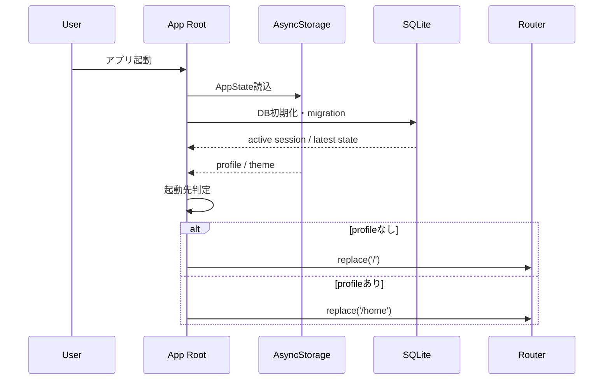
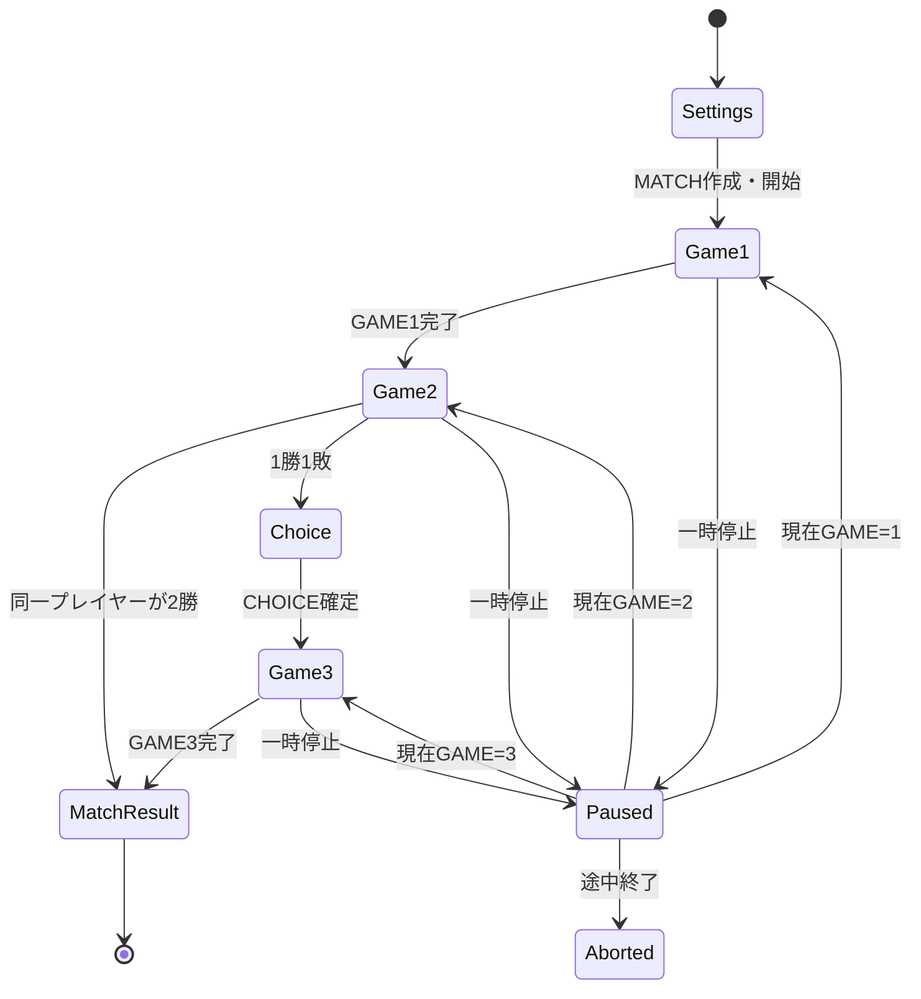
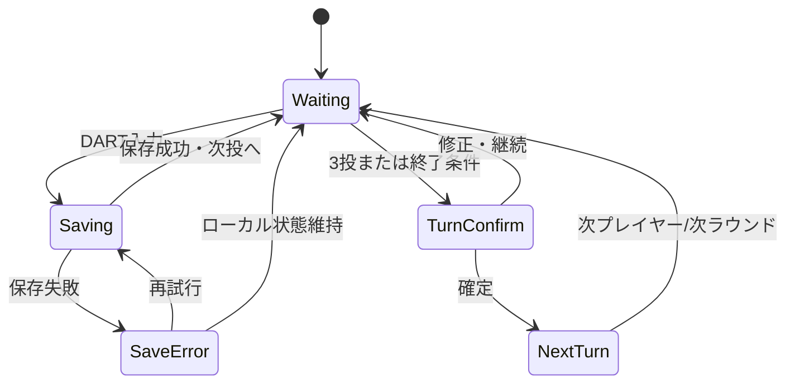
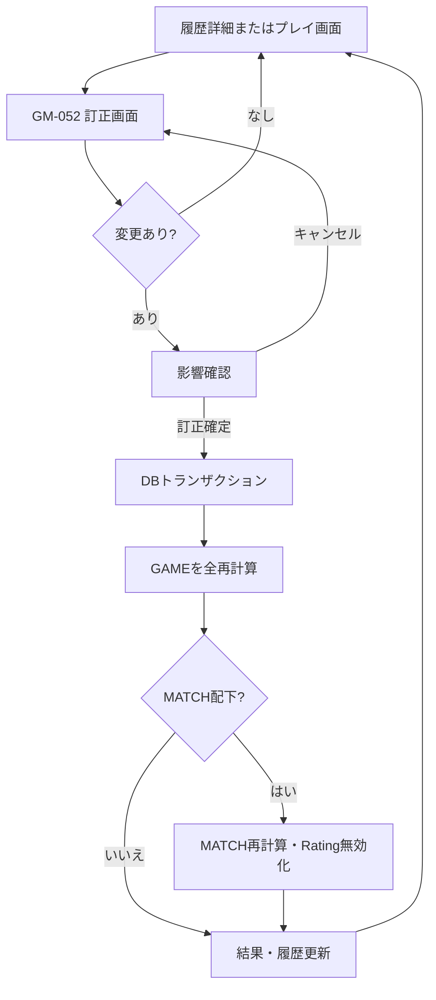
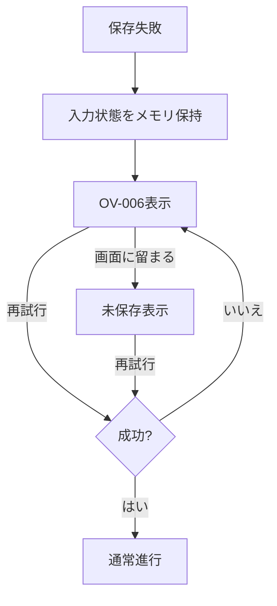

# DartsApp 画面遷移設計書

- 文書名: DartsApp 画面遷移設計書
- 文書バージョン: 1.0
- 作成日: 2026-07-12
- 対象リポジトリ: `ShijimiWORKs-sudo/shijimiworks-dartssuportapp`
- 対象アプリ: DartsApp（現行技術名: DartsSupportApp）
- 前提資料:
  - `DartsApp_詳細設計書_v1.0.md`
  - `DartsApp_DB設計書_v1.0.md`
- 対象フェーズ: ゲームハブ、COUNT-UP、01、STANDARD CRICKET、MATCH、履歴、Rating導線

---

## 1. 文書の目的

本書は、既存のDartsSupportApp MVPへゲーム実行機能を追加する際の、画面構成、Expo Routerのルート、画面間の遷移条件、戻る操作、中断・再開、エラー時の遷移を定義する。

対象とする主要導線は次のとおり。

1. ホームからゲームハブへ移動する
2. COUNT-UP、01、STANDARD CRICKETを設定して開始する
3. 2人用MATCHを設定して開始する
4. 1投ずつ入力し、ターンを確定する
5. Undo、訂正、一時停止、再開、途中終了を行う
6. ゲーム結果、MATCH結果、履歴詳細を確認する
7. DartsApp Ratingの概要と履歴を確認する
8. SQLiteの状態に応じて正しい画面へ復元する

本書では画面の情報構造と遷移を定義する。色、余白、フォントサイズ、最終的なビジュアルは別途UI設計で調整する。

---

## 2. 基本方針

### 2.1 既存MVPを維持する

既存の主なルートは削除・改名しない。

- `/home`
- `/practice`
- `/records`
- `/analysis`
- `/consult`
- `/photo-score`
- `/library`
- `/favorites`
- `/settings`

既存BottomNavも初期実装では維持する。

```text
ホーム / 練習 / 記録 / 分析 / 相談
```

ゲーム機能は、ホームに追加する主要CTA「ゲームを始める」から`/game`へ入る。ゲームハブ、設定、プレイ、結果、ゲーム履歴では専用のスタックナビゲーションを使用する。

### 2.2 プレイ中はBottomNavを表示しない

ゲーム中に誤って別機能へ遷移することを防ぐため、次の画面ではBottomNavを非表示とする。

- COUNT-UPプレイ
- 01プレイ
- CRICKETプレイ
- MATCH進行
- CHOICE選択
- ターン修正

設定画面、結果画面、履歴画面でも原則としてゲーム専用ヘッダーを使用し、既存BottomNavは表示しない。

### 2.3 戻る操作でゲームを破棄しない

進行中ゲームからの戻る操作は、iOSのスワイプバック、ヘッダー戻る、Androidの戻るボタンを含めてインターセプトする。

表示する選択肢は次のとおり。

- 一時停止してゲームハブへ戻る
- ゲームを続ける
- 途中終了する

「戻る」だけで進行中ゲームを削除してはならない。

### 2.4 DB状態を遷移の正本とする

ゲーム画面の復元先は、URLだけでなくSQLiteの次の状態から判定する。

- MATCH状態
- GAME状態
- 現在GAME
- 現在プレイヤー
- 現在ラウンド
- 現在TURN
- 完了・中断・無効状態

URLとDB状態が矛盾する場合は、DB状態を優先して正しい画面へ`replace`する。

### 2.5 画面内状態とルートを分離する

次は独立ルートではなく、プレイ画面上の共通コンポーネントまたはオーバーレイとして扱う。

- 投擲入力パネル
- ターン確認
- BUST表示
- CHECKOUT表示
- GAME完了表示
- 保存中・保存失敗表示

これにより、1投ごとに画面ルートが増えることを防ぐ。

---

## 3. ナビゲーション階層

```text
既存アプリ
├─ /
│  └─ 初期設定
├─ /home
│  ├─ /game
│  ├─ /practice
│  ├─ /records
│  ├─ /analysis
│  ├─ /consult
│  └─ /settings
└─ /game
   ├─ /game/players
   ├─ /game/count-up/settings
   ├─ /game/count-up/[gameId]
   ├─ /game/count-up/[gameId]/result
   ├─ /game/01/settings
   ├─ /game/01/[gameId]
   ├─ /game/01/[gameId]/result
   ├─ /game/cricket/settings
   ├─ /game/cricket/[gameId]
   ├─ /game/cricket/[gameId]/result
   ├─ /game/match/settings
   ├─ /game/match/[matchId]
   ├─ /game/match/[matchId]/choice
   ├─ /game/match/[matchId]/result
   ├─ /game/[gameId]/turns/[turnId]/edit
   ├─ /game/history
   ├─ /game/history/game/[gameId]
   ├─ /game/history/match/[matchId]
   ├─ /rating
   └─ /rating/history
```

---

## 4. ルート・画面一覧

### 4.1 ゲーム共通

| 画面ID | ルート                               | 画面名             | 表示方式         | 主な責務                                 |
| ------ | ------------------------------------ | ------------------ | ---------------- | ---------------------------------------- |
| GM-001 | `/game`                              | ゲームハブ         | Stack            | モード選択、再開、最近の結果、Rating概要 |
| GM-002 | `/game/players`                      | プレイヤー管理     | StackまたはModal | ゲスト作成・編集・archive                |
| GM-050 | ルートなし                           | 投擲入力パネル     | 画面内固定領域   | セグメント、BULL、MISS、Undo             |
| GM-051 | ルートなし                           | ターン確認         | Bottom Sheet     | 1～3投確認、修正、確定                   |
| GM-052 | `/game/[gameId]/turns/[turnId]/edit` | 確定済みターン修正 | Modal Stack      | 過去ターン訂正、影響確認、再計算         |

### 4.2 COUNT-UP

| 画面ID | ルート                           | 画面名         | 主な責務                       |
| ------ | -------------------------------- | -------------- | ------------------------------ |
| GM-010 | `/game/count-up/settings`        | COUNT-UP設定   | プレイヤー、ブル方式、開始確認 |
| GM-011 | `/game/count-up/[gameId]`        | COUNT-UPプレイ | 8ラウンド、累計、投擲入力      |
| GM-012 | `/game/count-up/[gameId]/result` | COUNT-UP結果   | 得点、平均、BULL、統計、再挑戦 |

### 4.3 01

| 画面ID | ルート                     | 画面名   | 主な責務                                 |
| ------ | -------------------------- | -------- | ---------------------------------------- |
| GM-020 | `/game/01/settings`        | 01設定   | プレイヤー、開始点、アウト方式、ブル方式 |
| GM-021 | `/game/01/[gameId]`        | 01プレイ | 残り点、BUST、CHECKOUT、投擲入力         |
| GM-022 | `/game/01/[gameId]/result` | 01結果   | PPD、3DA、投数、BUST、終了状態           |

### 4.4 STANDARD CRICKET

| 画面ID | ルート                          | 画面名        | 主な責務                         |
| ------ | ------------------------------- | ------------- | -------------------------------- |
| GM-030 | `/game/cricket/settings`        | CRICKET設定   | プレイヤー、ブル方式、開始確認   |
| GM-031 | `/game/cricket/[gameId]`        | CRICKETプレイ | 20～15/BULLのマーク、得点、CLOSE |
| GM-032 | `/game/cricket/[gameId]/result` | CRICKET結果   | MPR、マーク、得点、クローズ履歴  |

### 4.5 MATCH

| 画面ID | ルート                         | 画面名     | 主な責務                              |
| ------ | ------------------------------ | ---------- | ------------------------------------- |
| GM-040 | `/game/match/settings`         | MATCH設定  | 2人、501/701、アウト、ブル、先攻      |
| GM-041 | `/game/match/[matchId]`        | MATCH進行  | GAME 1～3の進行、現在GAMEのプレイ表示 |
| GM-042 | `/game/match/[matchId]/choice` | CHOICE選択 | GAME 3を01またはCRICKETから決定       |
| GM-043 | `/game/match/[matchId]/result` | MATCH結果  | 2-0/2-1、各GAME、Rating評価候補       |

### 4.6 履歴・Rating

| 画面ID | ルート                          | 画面名         | 主な責務                               |
| ------ | ------------------------------- | -------------- | -------------------------------------- |
| GM-060 | `/game/history`                 | ゲーム履歴一覧 | 日付、モード、状態、プレイヤーで絞込み |
| GM-061 | `/game/history/game/[gameId]`   | ゲーム履歴詳細 | ラウンド、ターン、DART、統計、訂正     |
| GM-062 | `/game/history/match/[matchId]` | MATCH履歴詳細  | 各GAME、勝敗、Rating評価状態           |
| GM-070 | `/rating`                       | Rating概要     | Rating、信頼度、評価MATCH数、構成指標  |
| GM-071 | `/rating/history`               | Rating履歴     | MATCHごとの変動、無効化・除外理由      |

---

## 5. 既存画面との接続

### 5.1 ホーム `/home`

ホームへ次の要素を追加する。

1. 主要CTA「ゲームを始める」
2. 進行中ゲームがある場合の「ゲームを再開」カード
3. DartsApp Ratingサマリー
4. 最近のゲーム結果1～3件

遷移:

| 操作           | 遷移先                   | 方法   |
| -------------- | ------------------------ | ------ |
| ゲームを始める | `/game`                  | `push` |
| ゲームを再開   | DB状態に応じたプレイ画面 | `push` |
| Ratingカード   | `/rating`                | `push` |
| 最近のゲーム   | GAMEまたはMATCH履歴詳細  | `push` |

### 5.2 記録 `/records`

既存の練習記録一覧は維持する。画面上部またはセクション内に「ゲーム履歴を見る」を追加する。

```text
/records → /game/history
```

既存PracticeRecordとゲーム履歴を同一一覧へ直接混在させない。

### 5.3 分析 `/analysis`

次のカードを追加する。

- DartsApp Rating
- 直近01 PPD / 3DA
- 直近CRICKET MPR
- ゲーム分析へ移動

遷移:

```text
/analysis → /rating
/analysis → /game/history
```

### 5.4 設定 `/settings`

初期版ではゲームの細かな設定画面を独立させず、各モードの開始設定画面で選択する。

将来、既定値を保存する場合は`/settings/game`を追加できるが、v1.0の必須対象には含めない。

---

## 6. 全体画面遷移図

```mermaid
flowchart TD
    A[アプリ起動] --> B{プロフィール済み?}
    B -- いいえ --> C[/ 初期設定]
    C --> D[/home]
    B -- はい --> D

    D --> E[/game ゲームハブ]
    D --> R[/rating Rating概要]
    D --> H1[進行中ゲームを再開]

    E --> CU0[COUNT-UP設定]
    E --> Z0[01設定]
    E --> CR0[CRICKET設定]
    E --> M0[MATCH設定]
    E --> GH[ゲーム履歴]
    E --> R
    E --> H1

    CU0 --> CU1[COUNT-UPプレイ]
    CU1 --> CU2[COUNT-UP結果]

    Z0 --> Z1[01プレイ]
    Z1 --> Z2[01結果]

    CR0 --> CR1[CRICKETプレイ]
    CR1 --> CR2[CRICKET結果]

    M0 --> M1[MATCH進行 GAME1]
    M1 --> M2[MATCH進行 GAME2]
    M2 -->|2-0| M4[MATCH結果]
    M2 -->|1-1| M3[CHOICE選択]
    M3 --> M5[MATCH進行 GAME3]
    M5 --> M4

    GH --> GD[ゲーム履歴詳細]
    GH --> MD[MATCH履歴詳細]
    R --> RH[Rating履歴]

    CU2 --> E
    Z2 --> E
    CR2 --> E
    M4 --> E
```

---

## 7. アプリ起動時の遷移

### 7.1 起動シーケンス



### 7.2 進行中ゲームがある場合

進行中ゲームが存在しても、アプリ起動直後に強制的にプレイ画面へ遷移しない。

ホームに再開カードを表示し、ユーザーが明示的に再開する。

例外として、OSによる一時中断から短時間で復帰し、現在のルートが同一プレイ画面のままなら、その画面を維持する。

### 7.3 起動時エラー

| 状態                    | 遷移・表示                                    |
| ----------------------- | --------------------------------------------- |
| AsyncStorage読込失敗    | 既存の安全な既定値で表示し、非破壊エラー通知  |
| DB migration失敗        | GM-ERR-01 DB起動エラー画面                    |
| active gameの参照先欠損 | 該当GAMEを`invalid`候補とし、ゲームハブへ移動 |
| URLのIDが存在しない     | GM-ERR-02 対象なし画面                        |

---

## 8. ゲームハブ GM-001

### 8.1 表示優先順位

1. 進行中ゲーム再開カード
2. ゲームモード選択
3. DartsApp Rating概要
4. 最近のゲーム結果
5. ゲーム履歴へのリンク

### 8.2 モードカード

- COUNT-UP
- 01
- STANDARD CRICKET
- MATCH

将来機能の「道場」「CRICKET COUNT-UP」は、初期版ではカードを表示しない。予告表示を行う場合も開始操作は提供しない。

### 8.3 進行中ゲームがある場合

進行中ゲームは初期版で最大1件。

カードに表示する情報:

- モード
- MATCHの場合はGAME番号
- プレイヤー名
- 現在ラウンド
- 最終保存日時
- 状態: 進行中 / 一時停止 / 保存再試行中

操作:

| 操作     | 結果                                           |
| -------- | ---------------------------------------------- |
| 再開     | DB状態に対応するプレイ画面へ`push`             |
| 途中終了 | OV-003を表示                                   |
| 破棄     | OV-004を表示。実行後は履歴上の扱いを設計に従う |

### 8.4 新規ゲーム開始時のガード

進行中ゲームが存在する状態でモードカードを押した場合、設定画面へ直接移動せずOV-001を表示する。

選択肢:

- 進行中ゲームを再開
- 進行中ゲームを途中終了して新規設定へ
- キャンセル

初期版では2つのゲームを同時に進行させない。

---

## 9. プレイヤー管理 GM-002

### 9.1 入口

- 各モード設定画面のプレイヤー選択
- MATCH設定のPlayer 1 / Player 2選択
- ゲームハブの補助メニュー

### 9.2 操作

- ゲスト作成
- 表示名編集
- 利き手編集
- archive
- 匿名化

OWNERは初期プロフィールから自動作成または初回ゲーム開始時に作成する。

### 9.3 遷移

プレイヤー選択のために開いた場合は、選択完了後に呼出元へ戻り、選択した`playerId`をフォーム状態へ反映する。

設定途中の内容を失わないように、設定画面のフォーム状態は画面ローカルまたは一時ドラフトとして保持する。

---

## 10. COUNT-UP遷移

### 10.1 遷移図

```mermaid
flowchart LR
    A[/game] --> B[GM-010 設定]
    B -->|開始| C[GAME作成]
    C --> D[GM-011 プレイ]
    D -->|8R完了| E[GAME完了保存]
    E --> F[GM-012 結果]
    F -->|同じ条件でもう一度| B
    F -->|ゲームハブ| A
    F -->|詳細| G[GM-061 履歴詳細]
```

### 10.2 GM-010 COUNT-UP設定

必須項目:

- プレイヤー
- ブル方式

固定値:

- 8ラウンド
- 最大24投

初期値:

- プレイヤー: OWNER
- ブル方式: 直近利用値。存在しなければ`fat_bull`

開始ボタン押下時:

1. 入力検証
2. active game再確認
3. SQLiteへGAMEを`in_progress`で作成
4. 初期ROUND / TURN作成
5. `/game/count-up/[gameId]`へ`replace`

DB作成に失敗した場合は設定画面に留まり、二重作成を防ぐ。

### 10.3 GM-011 COUNT-UPプレイ

正常遷移:

- 1～3投入力
- ターン確定
- 次ラウンド
- 8ラウンド終了
- `/game/count-up/[gameId]/result`へ`replace`

途中操作:

| 操作               | 遷移                                   |
| ------------------ | -------------------------------------- |
| 戻る               | OV-002 一時停止・退出確認              |
| 一時停止           | GAMEを`paused`にして`/game`へ`replace` |
| 途中終了           | OV-003確認後、履歴詳細またはゲームハブ |
| 確定済みターン修正 | GM-052                                 |
| 保存失敗           | OV-006。画面状態保持                   |

### 10.4 GM-012 COUNT-UP結果

表示:

- 合計得点
- 1ラウンド平均
- BULL数
- TRIPLE数
- DOUBLE数
- 最高ラウンド
- 投数
- 入力由来内訳
- PracticeRecord連携状態

操作:

- 同じ条件でもう一度
- 設定を変えてもう一度
- ゲームハブへ
- 履歴詳細へ

「もう一度」は新しいGAMEを作成する。過去GAMEを再利用しない。

---

## 11. 01遷移

### 11.1 遷移図

```mermaid
flowchart LR
    A[/game] --> B[GM-020 01設定]
    B --> C[GAME作成]
    C --> D[GM-021 01プレイ]
    D -->|CHECKOUT| E[GM-022 01結果]
    D -->|15R終了| E
    D -->|途中終了| H[GM-061 履歴詳細]
    E -->|再挑戦| B
    E -->|ハブ| A
```

### 11.2 GM-020 01設定

必須項目:

- プレイヤー
- 開始点: 301 / 501 / 701 / 901
- アウト方式: SINGLE OUT / MASTER OUT
- ブル方式: FAT BULL / SEPARATE BULL

固定値:

- 最大15ラウンド

非表示・選択不可:

- DOUBLE OUT

開始条件:

- 対応開始点である
- 対応アウト方式である
- プレイヤーが有効である
- 進行中ゲームがない

### 11.3 GM-021 01プレイ

画面の最優先表示:

- 残り点
- 現在ラウンド
- 現在ターン得点
- 直前3投
- アウト方式

状態別表示:

| 状態     | 表示・動作                                     |
| -------- | ---------------------------------------------- |
| 通常     | GM-050で入力                                   |
| BUST     | BUSTバナー、ターン開始残り点へ復元、ターン終了 |
| CHECKOUT | CHECKOUT演出、追加入力禁止、結果確定           |
| 15R到達  | ラウンド上限終了を表示し結果へ                 |
| 保存中   | 小さな保存状態表示。入力は直列化               |
| 保存失敗 | 入力を維持し再試行                             |

CHECKOUTまたは15ラウンド終了後:

1. GAME状態を`completed`
2. 結果集計保存
3. Outbox作成
4. `/game/01/[gameId]/result`へ`replace`

### 11.4 GM-022 01結果

表示:

- 開始点
- 最終残り点
- CHECKOUT成否
- PPD
- 3DA
- 有効得点
- 投数
- BUST数
- ラウンド数
- BULL / TRIPLE / DOUBLE
- Rating対象外であること（単独01の場合）

単独練習の01は、正式なDartsApp Rating算出対象にしない。

---

## 12. STANDARD CRICKET遷移

### 12.1 遷移図

```mermaid
flowchart LR
    A[/game] --> B[GM-030 CRICKET設定]
    B --> C[GAME作成]
    C --> D[GM-031 CRICKETプレイ]
    D -->|終了条件成立| E[GM-032 CRICKET結果]
    D -->|15R終了| E
    E -->|再挑戦| B
    E -->|ハブ| A
```

### 12.2 GM-030 CRICKET設定

必須項目:

- プレイヤー
- ブル方式

固定値:

- 対象: 20 / 19 / 18 / 17 / 16 / 15 / BULL
- 最大15ラウンド

単独練習では、マークとMPRを記録する。対人得点競争はMATCH内CRICKETで扱う。

### 12.3 GM-031 CRICKETプレイ

画面の最優先表示:

- 20～15/BULLのマーク状態
- 現在ラウンド
- 現在ターン
- 総マーク数
- MPR暫定値

終了時:

- 単独練習の終了条件または15ラウンド到達で完了
- 結果へ`replace`

### 12.4 GM-032 CRICKET結果

表示:

- 総マーク数
- MPR
- ナンバー別マーク
- CLOSE達成順
- 投数
- ラウンド数
- BULLマーク
- Rating対象外であること（単独CRICKETの場合）

---

## 13. MATCH遷移

### 13.1 MATCH全体遷移



### 13.2 GM-040 MATCH設定

必須項目:

- Player 1
- Player 2
- GAME 1開始点: 501 / 701
- アウト方式: SINGLE OUT / MASTER OUT
- ブル方式: FAT BULL / SEPARATE BULL
- GAME 1先攻

検証:

- 2人が同一`playerId`ではない
- Player 2は有効なGUEST
- 開始点は501または701
- 未対応のDOUBLE OUTではない
- active gameが存在しない

開始処理:

1. `matches`作成
2. `match_players`作成
3. GAME 1の`game_sessions`作成
4. MATCHを`in_progress`
5. `/game/match/[matchId]`へ`replace`

### 13.3 GM-041 MATCH進行

このルートはMATCH全体のシェルであり、現在GAMEの種別に応じて次の表示を内部で切り替える。

- GAME 1: 01 Play View
- GAME 2: Cricket Play View
- GAME 3: Choiceで選ばれた01またはCricket Play View

ルートはGAMEごとに変更せず、`/game/match/[matchId]`を維持する。

画面上部に常時表示:

- Player 1 / Player 2
- MATCHスコア
- GAME 1 / 2 / 3進捗
- 現在GAME
- 現在プレイヤー

#### GAME 1完了

GAME結果サマリーのオーバーレイを表示する。

選択肢:

- GAME 2へ進む
- 一時停止してゲームハブへ戻る
- GAME 1詳細を見る

「GAME 2へ進む」でCRICKETのGAMEを作成し、同一ルート内を更新する。

#### GAME 2完了

- 同一プレイヤーが2勝: MATCH完了処理後GM-043へ`replace`
- 1勝1敗: `/game/match/[matchId]/choice`へ`push`

#### GAME 3完了

MATCH完了処理後GM-043へ`replace`する。

### 13.4 先攻表示

- GAME 1: 設定で選択した先攻
- GAME 2: GAME 1の後攻
- GAME 3: GAME 2の後攻

各GAME開始前に先攻表示を行い、ユーザーが確認してから最初のTURNを開始する。

### 13.5 GM-042 CHOICE選択

表示条件:

- MATCHが`in_progress`
- GAME 1とGAME 2が完了
- MATCHスコアが1-1
- GAME 3が未作成

選択肢:

- GAME 1と同じ01
- STANDARD CRICKET

01を選んだ場合、開始点・アウト方式・ブル方式はGAME 1を引き継ぎ、変更できない。

任意項目:

- 選択者
- メモ

確定処理:

1. 選択内容保存
2. GAME 3作成
3. `/game/match/[matchId]`へ`replace`

戻る操作ではMATCHを終了せず、CHOICE未確定のまま一時停止できる。

### 13.6 GM-043 MATCH結果

表示:

- MATCH勝者
- 2-0または2-1
- GAME 1～3結果
- 各プレイヤーの01 PPD / 3DA
- 各プレイヤーのCRICKET MPR
- BULL / TRIPLE / BUST
- Rating評価状態
- Rating更新前後（計算済みの場合）
- Rating計算待ち、除外、無効の理由

操作:

- Ratingを見る
- MATCH履歴詳細
- 同じ設定で再戦
- ゲームハブへ

再戦ではプレイヤーとルールをプリセットしたGM-040へ遷移し、新しいMATCHを作成する。

---

## 14. 投擲入力・ターン確認

### 14.1 GM-050 投擲入力パネル

ルートを持たない共通コンポーネントとする。

入力方式:

- SINGLE選択後、1～20
- DOUBLE選択後、1～20
- TRIPLE選択後、1～20
- OUTER BULL
- INNER BULL
- MISS

代替UIとして、1～20を先に選び倍率を選ぶ方式でもよいが、アプリ全体で一貫させる。

必須操作:

- 1投登録
- 直前1投Undo
- ターン終了
- 入力履歴確認

入力中は連打による重複を防ぐため、`client_action_id`単位で処理する。

### 14.2 GM-051 ターン確認

表示タイミング:

- 3投入力時
- ユーザーが「ターン終了」を押した時
- ゲームエンジンがターン終了候補を返した時

表示:

- DART 1～3
- ターン得点またはマーク
- BUST / CHECKOUT等の判定
- ターン開始前後の状態

操作:

- 確定
- 対象DARTを修正
- 直前DARTを削除
- キャンセルして入力継続

BUSTまたはCHECKOUTが成立した場合、ゲームルール上追加投擲できないため「入力継続」は表示しない。

### 14.3 1投入力の画面状態



---

## 15. 一時停止・再開・途中終了

### 15.1 一時停止

一時停止時の処理:

1. 未確定DARTの保存状態を確認
2. TURNの途中状態を保存
3. GAMEまたはMATCHを`paused`
4. 最終保存日時を更新
5. `/game`へ`replace`

TURN途中でも一時停止可能とする。再開時は同じTURN・同じ投順へ戻る。

### 15.2 再開先判定

```text
active sessionが単独COUNT-UP → /game/count-up/[gameId]
active sessionが単独01       → /game/01/[gameId]
active sessionが単独CRICKET  → /game/cricket/[gameId]
active sessionがMATCH        → /game/match/[matchId]
MATCHがCHOICE待ち            → /game/match/[matchId]/choice
```

### 15.3 途中終了

OV-003で確認する。

入力項目:

- 理由（任意）

確定後:

- 状態を`aborted`
- Rating対象外
- 結果画面ではなく履歴詳細へ遷移するか、ゲームハブへ戻る

初期推奨:

```text
途中終了完了 → /game/history/game/[gameId]
MATCH途中終了 → /game/history/match/[matchId]
```

### 15.4 破棄

「破棄」は通常の途中終了より強い操作として扱う。

- 初期版では物理削除しない
- `deleted_at`または破棄イベントを記録
- 通常の履歴一覧では非表示
- Rating対象外

ユーザー向け文言では「このゲームを破棄」とし、「完全削除」と誤認させない。

---

## 16. 履歴遷移

### 16.1 GM-060 ゲーム履歴一覧

入口:

- ゲームハブ
- 既存記録画面
- 分析画面
- 結果画面

一覧単位:

- 単独GAME
- MATCH

MATCH内のGAMEは通常一覧へ個別表示せず、MATCHカードの子情報として表示する。フィルタで「GAME単位」を選択した場合のみ個別表示してもよい。

絞込み:

- 期間
- モード
- 状態
- プレイヤー
- Rating対象 / 対象外

遷移:

- 単独GAME → GM-061
- MATCH → GM-062

### 16.2 GM-061 ゲーム履歴詳細

表示:

- 基本設定
- 状態
- 結果統計
- ラウンド一覧
- ターン一覧
- DART 1～3
- 入力由来
- 修正履歴
- PracticeRecord連携状態

操作:

- 確定済みターン修正
- 訂正履歴確認
- 再挑戦
- 論理削除

MATCH配下のGAMEを表示している場合は「MATCH詳細へ」を表示する。

### 16.3 GM-062 MATCH履歴詳細

表示:

- MATCH設定
- 参加者
- MATCHスコア
- GAME 1～3
- 各GAME統計
- Rating評価
- Rating無効化・再計算状態
- 訂正履歴

操作:

- 各GAME詳細
- Rating履歴
- 再戦
- MATCH訂正
- 論理削除

---

## 17. 訂正遷移 GM-052

### 17.1 入口

- プレイ中の直前確定TURN
- GM-061のTURN詳細
- GM-062から各GAMEのTURN詳細

### 17.2 遷移図



### 17.3 訂正前確認

確認文には影響を明示する。

- このTURN以降の残り点・マーク・勝敗を再計算する
- GAMEの勝敗が変わる可能性がある
- MATCH結果が変わる可能性がある
- Ratingを再計算する可能性がある

### 17.4 訂正不能条件

- 対象GAMEが物理的に読み取れない
- DARTの正本に欠損がある
- migration途中
- 別の書込みトランザクション中

訂正不能時は閲覧専用にし、データを自動初期化しない。

---

## 18. Rating画面遷移

### 18.1 GM-070 Rating概要

入口:

- ホーム
- ゲームハブ
- 分析
- MATCH結果
- MATCH履歴詳細

状態別表示:

| MATCH数・状態 | 表示                     |
| ------------- | ------------------------ |
| 0             | 未測定。MATCH開始導線    |
| 1             | 仮測定 1/3               |
| 2             | 仮測定 2/3               |
| 3～4          | 暫定Rating               |
| 5～9          | 標準Rating               |
| 10以上        | 安定Rating               |
| 再計算中      | 直近確定値と再計算中表示 |
| 評価不能      | 理由と対象MATCH確認導線  |

表示:

- DartsApp Rating
- 信頼度
- 評価MATCH数
- 01指数
- CRICKET指数
- 対戦指数
- 最終更新日時
- 独自方式による参考値の注記

### 18.2 GM-071 Rating履歴

一覧:

- MATCH日時
- 変更前Rating
- 変更後Rating
- 増減
- 信頼度
- 評価状態
- 除外理由

選択時:

```text
Rating履歴 → MATCH履歴詳細
```

Ratingスナップショットから対象MATCHへ遷移できること。

---

## 19. オーバーレイ・ダイアログ一覧

| ID     | 名称             | 表示条件                   | 主な選択肢                           |
| ------ | ---------------- | -------------------------- | ------------------------------------ |
| OV-001 | 進行中ゲームあり | 新規ゲームを始めようとした | 再開 / 途中終了して新規 / キャンセル |
| OV-002 | 一時停止・退出   | プレイ中に戻る             | 一時停止して戻る / 続ける / 途中終了 |
| OV-003 | 途中終了確認     | 途中終了操作               | 途中終了 / キャンセル                |
| OV-004 | 破棄確認         | 破棄操作                   | 破棄 / キャンセル                    |
| OV-005 | 訂正影響確認     | 確定済みTURN訂正           | 訂正確定 / 戻る                      |
| OV-006 | 保存失敗         | DART、TURN、GAME保存失敗   | 再試行 / 画面に留まる                |
| OV-007 | 手動勝者決定     | ラウンド上限等で同点       | Player 1 / Player 2 / キャンセル     |
| OV-008 | GAME完了         | MATCH内GAME完了            | 次GAME / 一時停止 / 詳細             |
| OV-009 | 入力取消確認     | 確定済みTURNを戻す         | 戻す / キャンセル                    |
| OV-010 | プレイヤー選択   | 設定画面のプレイヤー欄     | 選択 / 新規ゲスト / 管理             |
| OV-011 | 未保存設定       | 設定変更中に戻る           | 破棄して戻る / 編集継続              |
| OV-012 | Rating再計算通知 | MATCH訂正確定時            | 確認                                 |

ダイアログを重ねて表示してはならない。既存ダイアログを閉じてから次を表示する。

---

## 20. 戻る・閉じる動作

| 画面       | 戻る動作                                   |
| ---------- | ------------------------------------------ |
| ゲームハブ | `/home`へ戻る                              |
| 各設定     | 変更なしならゲームハブ。変更ありならOV-011 |
| 単独プレイ | OV-002                                     |
| MATCH進行  | OV-002                                     |
| CHOICE     | 一時停止確認。未確定のままMATCHへ戻さない  |
| 結果       | ゲームハブへ。完了済みプレイ画面へ戻さない |
| 履歴一覧   | 呼出元またはゲームハブ                     |
| 履歴詳細   | 履歴一覧                                   |
| 訂正       | 未保存変更があれば確認                     |
| Rating概要 | 呼出元                                     |
| Rating履歴 | Rating概要                                 |

### 20.1 iOSスワイプバック

プレイ中、CHOICE、訂正画面では、ネイティブのスワイプバックを無条件で許可しない。

- プレイ中: 無効化またはOV-002へ変換
- CHOICE: OV-002へ変換
- 訂正: 変更ありなら確認

### 20.2 結果画面の履歴スタック

プレイ完了時は`push`ではなく`replace`を使い、ブラウザバックや戻る操作で完了済みプレイ画面へ戻らないようにする。

---

## 21. ルートガード

### 21.1 共通ガード

全ゲームルートで次を確認する。

- IDが存在する
- `deleted_at`が未設定または閲覧許可状態
- GAME種別とルートが一致する
- MATCH配下か単独かが一致する
- DB migrationが完了している

### 21.2 プレイ画面ガード

| DB状態        | 遷移先                              |
| ------------- | ----------------------------------- |
| `in_progress` | プレイ継続                          |
| `paused`      | 再開処理後プレイ継続                |
| `completed`   | 対応する結果画面へ`replace`         |
| `aborted`     | 履歴詳細へ`replace`                 |
| `invalid`     | 履歴詳細またはエラー画面へ`replace` |
| 対象なし      | GM-ERR-02                           |

### 21.3 MATCHガード

| MATCH状態           | 遷移先        |
| ------------------- | ------------- |
| GAME 1～3進行中     | GM-041        |
| 1-1かつCHOICE未確定 | GM-042        |
| `completed`         | GM-043        |
| `aborted`           | GM-062        |
| `invalid`           | GM-062 + 警告 |

### 21.4 設定画面ガード

active gameが存在する場合、開始操作の直前に再確認する。設定画面を開いた後に別処理でactive gameが作成された場合も、二重開始を禁止する。

---

## 22. エラー画面・エラー遷移

### 22.1 エラー画面

| 画面ID    | 名称                   | 用途                    |
| --------- | ---------------------- | ----------------------- |
| GM-ERR-01 | ゲームDB起動エラー     | migration・DB open失敗  |
| GM-ERR-02 | データが見つかりません | 不正ID、削除済みURL     |
| GM-ERR-03 | ゲームデータ不整合     | TURN/DART欠損、状態矛盾 |
| GM-ERR-04 | 復旧できない保存エラー | 再試行後も永続化不可    |

### 22.2 エラー時の原則

- 既存AppStateを初期化しない
- ゲームDB全体を自動削除しない
- 入力中の画面状態を可能な限り保持する
- 再試行を提供する
- 開発者向け内部エラーとユーザー向け文言を分離する

### 22.3 ユーザー向け文言例

```text
保存できませんでした。
入力内容はこの画面に残っています。通信ではなく端末内保存の処理で問題が起きています。
もう一度保存してください。
```

```text
このゲームの一部データを正しく読み込めませんでした。
履歴は削除せず、安全のためRating計算から除外します。
```

### 22.4 保存失敗時の遷移



未保存状態のまま別画面へ通常遷移させない。

---

## 23. バックグラウンド・復帰

### 23.1 バックグラウンド移行

プレイ画面でアプリがバックグラウンドへ移行する場合:

1. 現在の未確定入力を安全な一時状態として保持
2. 既に確定したDARTまでSQLite保存
3. GAME状態は`in_progress`のままでもよい
4. 最終保存日時を更新

OSから十分な処理時間が与えられない可能性があるため、1投入力時点での自動保存を正本とし、バックグラウンド時保存だけに依存しない。

### 23.2 フォアグラウンド復帰

同一画面が維持されている場合:

- DBとメモリ状態を照合
- DBが新しい場合はDBを採用
- 未保存メモリ状態がある場合は再試行
- 他経路でGAMEが完了していれば結果画面へ`replace`

### 23.3 強制終了後の復帰

アプリ再起動後はゲームハブまたはホームの再開カードから再開する。

復元対象:

- 現在GAME
- 現在プレイヤー
- 現在ラウンド
- TURN内投順
- 既に確定したDART
- 残り点・マーク状態
- MATCHスコア
- CHOICE待ち状態

---

## 24. Deep Link・直接URL対策

初期版で外部Deep Linkを積極的に公開しなくても、Expo Routerでは直接パスが開かれる可能性があるため、各画面でガードする。

例:

```text
/game/01/unknown-id
→ GM-ERR-02

/game/count-up/{01のgameId}
→ 正しい01ルートへreplace

/game/match/{completedMatchId}
→ MATCH結果へreplace

/game/match/{matchId}/choice ただしスコア2-0
→ MATCH結果または進行画面へreplace
```

ルートパラメータを信頼してゲーム種別や状態を決定しない。

---

## 25. 画面別ローディング状態

### 25.1 初回DB読込

ゲームルートへ入った直後、必要データ取得中は専用スケルトンまたはローディングを表示する。

- 画面タイトルは表示可能なら先に表示
- 500ms未満の短い読込で全画面スピナーを点滅させない
- 読込中に操作ボタンを有効化しない

### 25.2 1投保存

1投ごとの保存では全画面ローディングを表示しない。

- 入力ボタンの二重操作だけを抑止
- 画面上部または小さな状態表示に「保存中」
- 成功後は表示を消す

### 25.3 Rating計算

MATCH結果保存後にRating計算が即時完了しない場合、MATCH結果画面をブロックしない。

```text
Ratingを計算しています
→ 計算完了後に表示更新
```

アプリ再起動後も再計算対象を検出できること。

---

## 26. アクセシビリティ上の遷移要件

- 遷移後、画面タイトルまたは主要見出しへVoiceOverフォーカスを移す
- BUST、CHECKOUT、GAME完了は色だけでなくテキストで通知する
- 現在プレイヤーの切替を読み上げる
- ダイアログ表示時は背面要素へフォーカスを移動できないようにする
- 44pt相当以上のタップ領域を確保する
- 重要な戻る・途中終了操作を近接させない
- 投擲入力ボタンには「トリプル20、60点」等の明確なラベルを付ける

---

## 27. 画面遷移イベント

将来のデバッグ・分析用に、個人情報を含めない画面イベント名を定義する。

| イベント                    | タイミング     |
| --------------------------- | -------------- |
| `game_hub_viewed`           | GM-001表示     |
| `game_settings_opened`      | 各設定表示     |
| `game_start_requested`      | 開始ボタン押下 |
| `game_started`              | DB作成成功     |
| `game_paused`               | 一時停止成功   |
| `game_resumed`              | 再開成功       |
| `game_aborted`              | 途中終了成功   |
| `game_completed`            | GAME完了       |
| `match_choice_opened`       | CHOICE表示     |
| `match_completed`           | MATCH完了      |
| `turn_correction_opened`    | 訂正画面表示   |
| `turn_correction_committed` | 訂正保存成功   |
| `rating_viewed`             | Rating概要表示 |

初期版では外部送信しない。必要であれば端末内デバッグログとして利用する。

---

## 28. Expo Router実装方針

### 28.1 推奨ディレクトリ

```text
app/
├─ game/
│  ├─ _layout.tsx
│  ├─ index.tsx
│  ├─ players.tsx
│  ├─ count-up/
│  │  ├─ settings.tsx
│  │  └─ [gameId]/
│  │     ├─ index.tsx
│  │     └─ result.tsx
│  ├─ 01/
│  │  ├─ settings.tsx
│  │  └─ [gameId]/
│  │     ├─ index.tsx
│  │     └─ result.tsx
│  ├─ cricket/
│  │  ├─ settings.tsx
│  │  └─ [gameId]/
│  │     ├─ index.tsx
│  │     └─ result.tsx
│  ├─ match/
│  │  ├─ settings.tsx
│  │  └─ [matchId]/
│  │     ├─ index.tsx
│  │     ├─ choice.tsx
│  │     └─ result.tsx
│  ├─ [gameId]/turns/[turnId]/edit.tsx
│  └─ history/
│     ├─ index.tsx
│     ├─ game/[gameId].tsx
│     └─ match/[matchId].tsx
├─ rating/
│  ├─ index.tsx
│  └─ history.tsx
└─ ...既存ルート
```

### 28.2 Stack設定

`app/game/_layout.tsx`:

- プレイ画面のジェスチャーバックを制御
- ヘッダーはゲーム専用
- 結果画面は完了状態を示すタイトル
- 訂正画面はmodal presentation

### 28.3 遷移API

| 用途            | API                                   |
| --------------- | ------------------------------------- |
| 通常の一覧→詳細 | `router.push`                         |
| 設定→プレイ     | `router.replace`                      |
| プレイ→結果     | `router.replace`                      |
| 状態矛盾の補正  | `router.replace`                      |
| 一時停止→ハブ   | `router.replace('/game')`             |
| 訂正モーダル    | `router.push`またはmodal presentation |
| ダイアログ      | React Native Modal / 共通Dialog       |

---

## 29. 画面状態とDB状態の対応表

| 画面               | 必須DB状態                             |
| ------------------ | -------------------------------------- |
| GM-010/020/030/040 | active sessionなし                     |
| GM-011/021/031     | GAME=`in_progress`または`paused`       |
| GM-012/022/032     | GAME=`completed`                       |
| GM-041             | MATCH=`in_progress`かつ現在GAMEあり    |
| GM-042             | MATCH=`in_progress`、1-1、CHOICE未確定 |
| GM-043             | MATCH=`completed`                      |
| GM-052             | 対象TURN存在、訂正可能                 |
| GM-061             | GAME存在、deletedでないか閲覧許可      |
| GM-062             | MATCH存在、deletedでないか閲覧許可     |
| GM-070             | Player存在。Rating未測定でも表示可能   |
| GM-071             | Rating履歴0件でも空状態表示            |

---

## 30. 受入条件

### 30.1 基本導線

- ホームから2操作以内で各ゲーム設定へ到達できる
- ゲームハブから各モードを開始できる
- プレイ完了後、完了済みプレイ画面へ戻らない
- 結果から履歴詳細へ遷移できる
- Rating概要から対象MATCHへ遷移できる

### 30.2 中断・再開

- TURN途中で一時停止できる
- アプリ再起動後に同じTURN・同じ投順から再開できる
- 進行中ゲームがある状態で新規ゲームを二重作成できない
- CHOICE待ちMATCHを正しいCHOICE画面から再開できる

### 30.3 誤操作防止

- 戻る操作だけでゲームが破棄されない
- 途中終了、破棄、訂正に確認がある
- Player 1とPlayer 2へ同一人物を設定できない
- MATCHのCHOICEで別の01開始点を選べない

### 30.4 状態ガード

- 完了GAMEのプレイルートを開くと結果へ移動する
- 中断GAMEの結果ルートを開いても結果画面を偽表示しない
- 不明IDでクラッシュしない
- DB状態とURLが矛盾しても正しい画面へ補正される

### 30.5 保存エラー

- 保存失敗時に入力内容が消えない
- 再試行できる
- 未保存のまま通常遷移しない
- エラーを理由に既存データを初期化しない

---

## 31. 実装順序

画面遷移の実装順は次を推奨する。

1. `/game`ゲームハブと既存ホームからの導線
2. 共通Stack、ルートガード、active session判定
3. プレイヤー選択・管理
4. COUNT-UP設定・プレイ・結果
5. 01設定・プレイ・結果
6. CRICKET設定・プレイ・結果
7. 一時停止・再開・途中終了
8. ゲーム履歴一覧・詳細
9. MATCH設定・進行・CHOICE・結果
10. 確定済みTURN訂正
11. Rating概要・履歴
12. 既存分析・記録・ホームへのサマリー連携
13. エラー画面、Deep Link、バックグラウンド復旧の最終確認

---

## 32. 確定事項

本書v1.0で次を確定する。

- 既存BottomNavは初期版で維持する
- ホームの主要CTAからゲームハブへ入る
- プレイ画面ではBottomNavを非表示にする
- 設定からプレイ、プレイから結果は`replace`を基本とする
- 進行中ゲームは初期版で1件まで
- 戻る操作は一時停止確認へ変換する
- MATCHは1つの進行ルート内でGAME 1～3を切り替える
- 1-1の場合のみ独立CHOICE画面へ進む
- 投擲入力とターン確認は独立ルートではなく共通UIとする
- 完了後の訂正は専用画面で行い、GAME・MATCH・Ratingを再計算する
- URLとDB状態が矛盾する場合はDBを優先する
- 単独ゲーム結果とMATCH結果は別画面とする
- ゲーム履歴は既存PracticeRecord一覧へ直接混在させない
- Rating概要と履歴は独立ルートとする

---

## 33. 次工程との境界

次工程の「DartsApp Rating計算モジュール仕様書」では、本書の次の画面へ返す値を定義する。

- GM-043 MATCH結果
- GM-062 MATCH履歴詳細
- GM-070 Rating概要
- GM-071 Rating履歴

定義対象:

- Rating値
- 信頼度
- 01指数
- CRICKET指数
- 対戦指数
- 暫定・標準・安定状態
- MATCH評価可否
- 除外理由
- 訂正時の再計算結果
