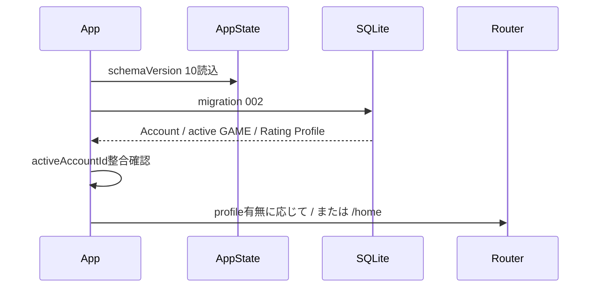

# DartsApp 画面遷移設計書 v1.1

- 文書バージョン: 1.1
- 旧版: `DartsApp_画面遷移設計書_v1.0.md`
- 対象: Account、Rating測定状態、単独01、単独CRICKET、MATCH、Rating導線

---

## 1. 改訂概要

v1.1では次を追加する。

- ローカルAccount登録・プロフィール導線
- OWNERとAccountの紐付け状態表示
- Rating初回3MATCH測定状態
- Rating確定後の単独01・CRICKET対象表示
- CRICKETの全CLOSE0点継続表示
- Account未登録でもゲームを継続できる非強制導線

---

## 2. 基本方針

1. 既存BottomNavを維持
2. プレイ中はBottomNavを非表示
3. Account未登録を理由にゲーム開始を禁止しない
4. Rating機能だけAccount・初回測定状態で制御する
5. URLよりSQLite状態を正本とする
6. 戻る操作で進行中GAMEを破棄しない
7. active GAMEは端末内1件

---

## 3. ルート構成

```text
/
/home
/account/register
/account/profile
/account/rating-status
/game
/game/count-up/settings
/game/count-up/[gameId]
/game/count-up/[gameId]/result
/game/01/settings
/game/01/[gameId]
/game/01/[gameId]/result
/game/cricket/settings
/game/cricket/[gameId]
/game/cricket/[gameId]/result
/game/match/settings
/game/match/[matchId]
/game/match/[matchId]/choice
/game/match/[matchId]/result
/rating
/rating/history
/settings
```

---

## 4. Account画面

### AC-001 `/account/register`

責務:

- ローカルAccount登録
- 既存OWNERとの紐付け
- Rating所有者の確定

入力:

- ユーザーID
- 表示名
- メールアドレス（任意）

表示:

```text
この登録は現在、この端末内でRating所有者を識別するためのものです。
クラウド同期と本人確認は今後対応予定です。
```

遷移:

| 操作 | 遷移 |
|---|---|
| 登録完了 | 呼出元または`/account/profile` |
| キャンセル | 呼出元 |
| 既存Accountあり | `/account/profile`へreplace |

### AC-002 `/account/profile`

表示:

- ユーザーID
- 表示名
- Account状態
- OWNER名
- Rating状態
- 登録日

操作:

- 表示名変更
- メール追加・変更
- Rating状態を見る
- 将来クラウド連携（準備中）

### AC-003 `/account/rating-status`

表示:

- 未測定 / 1/3 / 2/3 / 確定済み
- Eligible MATCH件数
- 単独Rating対象可否
- 確定日時
- Rating構成値

---

## 5. ホーム `/home`

表示優先順位:

1. 進行中GAME再開
2. ゲーム開始CTA
3. Accountカード
4. Ratingカード
5. 最近の結果

Account未登録:

```text
アカウント登録でRatingの所有者を保存できます
```

操作:

- `登録する` → `/account/register`
- `後で` → 何もしない

Account登録済み・Rating未確定:

```text
Rating測定中 1/3
初回RatingはMATCH 3回で確定します
```

Rating確定済み:

```text
DartsApp Rating x.x
単独01・CRICKETもRating対象です
```

---

## 6. ゲームハブ `/game`

モード:

- COUNT-UP
- 01 GAME
- STANDARD CRICKET
- MATCH

各単独モードカードへRating状態バッジを表示する。

| 状態 | 表示 |
|---|---|
| Accountなし | `Rating対象外: Account未登録` |
| 3MATCH未完了 | `Rating対象外: 初回測定前` |
| Rating確定済み | `Rating対象` |

COUNT-UPは常に`Rating対象外`。

active GAME再開route:

- `count_up` → `/game/count-up/[gameId]`
- `zero_one` → `/game/01/[gameId]`
- `cricket` → `/game/cricket/[gameId]`
- MATCH内GAME → `/game/match/[matchId]`

---

## 7. Account登録を促すタイミング

登録は強制しない。

表示タイミング:

- 初回ゲームハブ表示
- MATCH設定前
- Rating画面アクセス時
- 単独ゲーム結果でRating対象外だった場合

AccountなしでMATCHを開始する場合:

```text
MATCHは遊べますが、初回Rating測定には保存されません。
```

選択肢:

- Account登録する
- Rating対象外で続ける
- キャンセル

---

## 8. 単独01設定 `/game/01/settings`

既存項目を維持。

追加表示:

```text
Rating対象 / 対象外理由
```

Rating確定済みで開始する場合:

- `rating_candidate=1`
- 「今回の成績は01指数へ反映されます」

未確定:

- `rating_candidate=0`
- 「初回3MATCH確定後の単独01から対象です」

---

## 9. 単独CRICKET設定 `/game/cricket/settings`

必須:

- プレイヤー
- ブル方式
- 最大15ラウンド固定

説明:

```text
全ナンバーをCLOSEしても0点では終了しません。
1点以上を獲得すると自然終了できます。
```

Rating表示は単独01と同じ。

開始:

```text
/game/cricket/settings
→ GAME作成
→ /game/cricket/[gameId]
```

---

## 10. 単独CRICKETプレイ `/game/cricket/[gameId]`

最優先表示:

- 20 / 19 / 18 / 17 / 16 / 15 / BULLのマーク
- CLOSE状態
- 現在得点
- ROUND n / 15
- 現在TURNマーク
- 暫定MPR

### 10.1 全CLOSE0点

全ターゲットCLOSEかつ得点0になった場合、結果画面へ遷移しない。

バナー:

```text
ALL CLOSED
0点では終了できません
CLOSE済みナンバーで得点してください
```

入力は継続可能。

### 10.2 自然終了

```text
全CLOSE
かつ
得点 > 0
```

成立時:

1. GAME完了
2. `completion_reason=all_closed_with_score`
3. 結果保存
4. `/game/cricket/[gameId]/result`へreplace

### 10.3 15ラウンド

15R終了:

- 得点・CLOSE状態にかかわらず完了
- `completion_reason=round_limit`
- 0点なら`clear_flag=false`
- 結果画面へreplace

---

## 11. 単独CRICKET結果 `/game/cricket/[gameId]/result`

表示:

- 総マーク
- MPR
- 得点
- CLOSE数
- 全CLOSE成否
- 自然クリア / ROUND LIMIT
- ナンバー別マーク・得点
- 投数
- ROUND数
- BULLマーク
- Rating反映状態

0点round limit:

```text
ROUND LIMIT
全CLOSEしていても0点のためCLEARではありません
```

Rating確定済みなら、MPR評価自体は対象にできる。

---

## 12. MATCH設定

Account OWNERのRating初回測定導線を表示する。

- 0MATCH: `測定開始`
- 1MATCH: `あと2MATCH`
- 2MATCH: `あと1MATCH`
- 3MATCH以降: `Rating更新対象`

GUESTにはRating表示を付けない。

---

## 13. Rating概要 `/rating`

Accountなし:

- 登録案内
- Ratingは表示しない

Accountあり・未確定:

- 参考Rating
- 進捗 0/3～2/3
- 単独ゲームはまだ対象外

確定済み:

- 総合Rating
- 01 Index
- Cricket Index
- Match Index
- Confidence
- 最新変動元
- 単独Rating対象可

最新変動元表示:

- MATCH
- 単独01
- 単独CRICKET

---

## 14. Rating履歴 `/rating/history`

各行:

- 日時
- source type
- Rating前後
- 変動量
- PPDまたはMPR
- 対象 / 除外
- 除外理由

単独GAMEは、MATCHと区別できるアイコン・ラベルを使用する。

---

## 15. 起動時シーケンス



Account未完了でも強制的に登録画面へ飛ばさない。

---

## 16. 戻る・中断

ゲームプレイは従来どおり3択。

- 一時停止してゲームハブへ戻る
- ゲームを続ける
- 途中終了する

Account画面は未保存変更がある場合だけ確認する。

---

## 17. Route Guard

### Account

- `/account/profile`: Accountなし → `/account/register`
- `/account/rating-status`: Accountなし → `/account/register`

### CRICKET

- 不明ID → `/game`
- 別mode → 正しいrouteまたは`/game`
- completed → result
- aborted / invalid → `/game`
- paused → 再開UI

### Rating

- Accountなし → 登録案内を表示しroute自体は維持
- Profileなし → unmeasured表示

---

## 18. 受入条件

1. Account未登録でもCOUNT-UP・01・CRICKETを開始できる
2. Account登録後、OWNERと紐づく
3. Rating状態が0/3～確定で表示される
4. 初回確定前の単独ゲームに対象外表示が出る
5. 確定後の単独ゲームにRating対象表示が出る
6. CRICKET全CLOSE0点で結果へ進まない
7. 0点継続メッセージが表示される
8. 15R0点はround limit結果になる
9. Rating履歴でsource typeを区別できる
10. 既存COUNT-UP・01導線が壊れない
