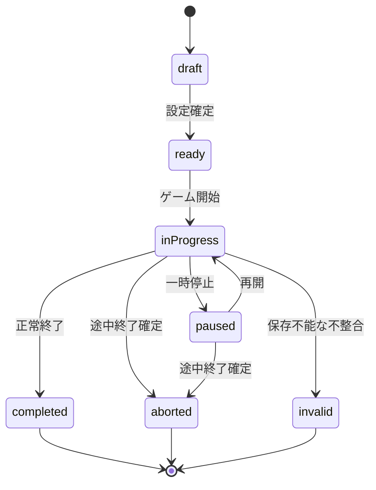
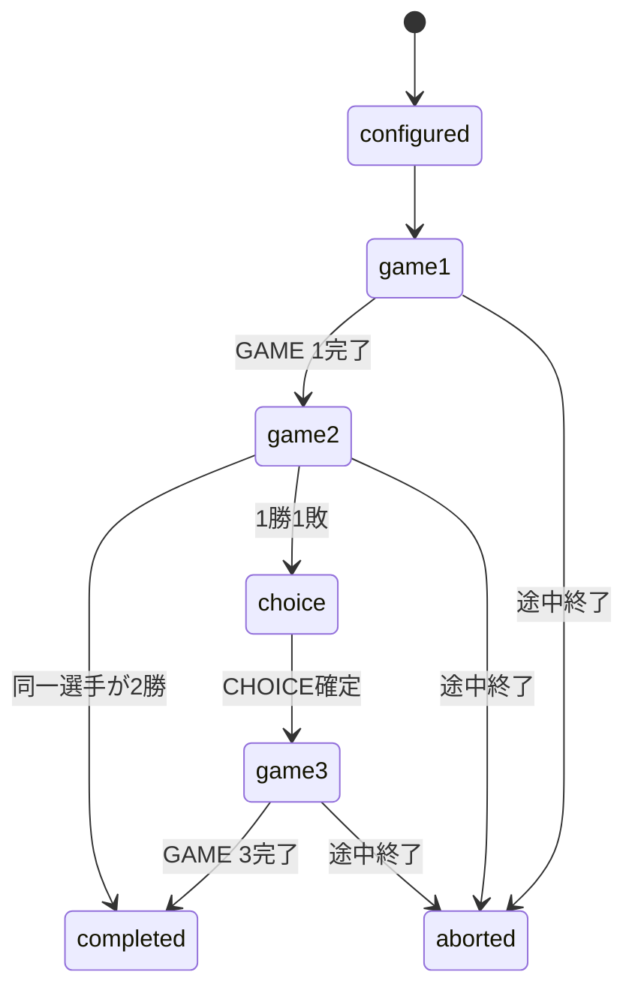

# DartsApp 詳細設計書

- 文書名: DartsApp 詳細設計書
- 文書バージョン: 1.0
- 作成日: 2026-07-12
- 対象リポジトリ: `ShijimiWORKs-sudo/shijimiworks-dartssuportapp`
- 現行アプリ技術名: `DartsSupportApp`
- 本設計上の製品呼称: `DartsApp`
- 対象フェーズ: ゲーム機能・対戦機能・投擲履歴・レーティング連携基盤の追加

---

## 1. 文書の目的

本書は、既存のDartsSupportApp MVPへ、ソフトダーツのゲーム実行機能を追加するための詳細設計を定義する。

対象となる主要機能は以下とする。

1. COUNT-UP
2. 01（301 / 501 / 701 / 901）
3. STANDARD CRICKET
4. MATCH（01 → CRICKET → CHOICE）
5. 1投単位の記録、修正、取消
6. ゲーム・ラウンド・スロー・ダーツ単位の履歴
7. DartsApp Ratingへ渡す評価対象データの生成
8. 既存の練習記録・分析・写真スコア機能との連携

本書では、次の資料に分離する内容については、境界・前提・必要項目までを定義し、物理的な詳細は確定しない。

- DB物理設計、テーブル定義、インデックス定義
- 画面遷移図、全遷移条件
- DartsApp Ratingの完全な計算式・閾値・換算表
- Codexへ渡す実装指示文

---

## 2. 開発方針

### 2.1 基本方針

既存MVPを作り直さず、現在の機能を維持したままゲーム領域を追加する。

既存の主な機能は維持対象とする。

- 練習メニュー
- 練習記録
- 写真スコア
- 分析
- フォーム相談
- 資料ライブラリ
- お気に入り
- 表示設定

ゲーム進行ロジックは画面コンポーネントから分離し、純粋関数を中心としたドメイン層として実装する。画面側は、現在状態の表示、ユーザー操作の受付、ゲームエンジンへの命令、結果表示だけを担当する。

### 2.2 既存構成との共存

現行アプリはExpo Router、React Native、TypeScript、React Context、AsyncStorageを利用している。新機能もこの技術構成を前提とする。

ただし、ゲームでは1投単位のデータが大量に蓄積するため、既存の単一AppStateへ全投データを直接追加しない。

設計上は以下のハイブリッド構成とする。

- 既存プロフィール、UI設定、練習フィルタ等: 既存AsyncStorageを継続
- ゲームセッション、ラウンド、ターン、投擲、MATCH履歴: 新規ゲーム保存層
- 物理保存方式: DB設計書で確定するが、SQLiteを第一候補とする
- 既存分析との連携: 完了ゲームから集計用PracticeRecordサマリーを生成

### 2.3 破壊的変更の禁止

以下を禁止する。

- 既存の練習記録を新ゲームデータへ強制変換する
- 既存写真スコア記録を削除または再採点する
- 現在のAppStateを初期化する
- 既存ルートを理由なく変更する
- 現行のロゴ、テーマ、法務ページ、EAS設定を削除する
- DARTSLIVEまたはPHOENIXの非公開ロジック、ロゴ、公式素材を複製する

---

## 3. 対象範囲

### 3.1 初期実装対象

| 機能         | 初期仕様                                               |
| ------------ | ------------------------------------------------------ |
| COUNT-UP     | 8ラウンド固定                                          |
| 01           | 301 / 501 / 701 / 901、最大15ラウンド                  |
| 01アウト方式 | シングルアウト / マスターアウト                        |
| 01将来予約   | ダブルアウトを型として予約するが、初期画面では選択不可 |
| ブル方式     | ファットブル / セパレートブル                          |
| CRICKET      | STANDARD CRICKET、最大15ラウンド                       |
| MATCH        | 2人対戦専用、01 → CRICKET → CHOICE                     |
| CHOICE       | GAME 1と同じ01またはSTANDARD CRICKET                   |
| 記録単位     | MATCH、GAME、ROUND、TURN、DART                         |
| 入力         | 手動スコア入力を必須、既存写真採点との連携境界を用意   |
| 中断         | 一時保存、再開、途中終了                               |
| 修正         | 直前ダーツ取消、ターン確定前修正、確定済みターン修正   |
| 履歴         | ゲーム結果、投擲履歴、主要統計                         |
| Rating連携   | 評価候補データと入力由来を保存                         |

### 3.2 将来追加として予約する機能

| 機能             | 予約内容                            |
| ---------------- | ----------------------------------- |
| 道場             | 50ラウンド長時間練習                |
| CRICKET COUNT-UP | クリケットナンバーのマーク数練習    |
| DOUBLE OUT       | 01のアウト方式                      |
| オンライン対戦   | アカウント・同期・通信対戦          |
| 自動画像認識     | OpenCV / Vision / ML等による実検出  |
| 外部機器連携     | ダーツマシン、センサー、Bluetooth等 |
| クラウド同期     | 複数端末同期、バックアップ          |
| 大会モード       | トーナメント、リーグ、複数セット    |

### 3.3 初期実装対象外

- DARTSLIVE / PHOENIX公式API連携
- 公式レーティング値の再現
- リアルタイムオンライン対戦
- 課金・サブスクリプション
- ログイン・会員管理
- 不正対策を含む公式競技認定
- 動画からの完全自動採点
- 3人以上のローカル対戦
- セット制・レッグ制の詳細カスタマイズ

---

## 4. 用語定義

| 用語            | 定義                                                 |
| --------------- | ---------------------------------------------------- |
| MATCH           | 01、CRICKET、必要時のCHOICEで構成される2人対戦       |
| GAME            | COUNT-UP、01、CRICKETの1回分                         |
| ROUND           | 各プレイヤーがそのラウンドのターンを行う単位         |
| TURN            | 1プレイヤーが最大3本を投げる単位                     |
| DART            | 1投分の記録                                          |
| CHECKOUT        | 01で残り点数をルールどおり0にして終了すること        |
| BUST            | 01で無効となったターン。ターン開始時の残り点数へ戻す |
| MARK            | CRICKET対象ナンバーへの有効命中数                    |
| CLOSE           | CRICKET対象ナンバーで3マーク以上を取得した状態       |
| FAT BULL        | インナー、アウターとも50点として扱うブル方式         |
| SEPARATE BULL   | インナー50点、アウター25点として扱うブル方式         |
| INPUT SOURCE    | 投擲結果がどの方法で確定されたかを示す属性           |
| RATING ELIGIBLE | レーティング計算候補として利用可能な状態             |
| ABORTED         | ユーザー操作等で途中終了した状態                     |

---

## 5. 利用者・プレイヤー設計

### 5.1 アプリ利用者

初期版ではログインを行わず、端末所有者を主利用者とする。

### 5.2 プレイヤー

プレイヤーはゲーム実行時の論理的な参加者であり、ユーザープロフィールとは分離する。

初期版では以下を扱う。

- `OWNER`: 端末利用者本人
- `GUEST`: 端末内だけで使用するゲスト

MATCHは必ず2プレイヤーとする。

- Player 1: OWNERまたはGUEST
- Player 2: GUEST

同一人物を両枠へ登録することは禁止する。

### 5.3 プレイヤー情報

初期版の必須情報は以下とする。

- プレイヤーID
- 表示名
- 種別（OWNER / GUEST）
- 利き手（任意）
- アイコンまたは色識別子（任意）
- 作成日時
- 最終利用日時

個人情報を最小限にするため、メールアドレス、住所、生年月日は保持しない。

---

## 6. システム構成

### 6.1 論理レイヤー

```text
Presentation Layer
  ├─ Expo Router Screen
  ├─ Game UI Components
  └─ Input Components

Application Layer
  ├─ GameSessionService
  ├─ MatchService
  ├─ GameHistoryService
  ├─ RatingDataService
  └─ PracticeRecordBridge

Domain Layer
  ├─ CountUpEngine
  ├─ ZeroOneEngine
  ├─ CricketEngine
  ├─ MatchEngine
  ├─ ThrowValidator
  ├─ ScoreCalculator
  └─ GameStateMachine

Persistence Layer
  ├─ GameRepository
  ├─ MatchRepository
  ├─ PlayerRepository
  ├─ RatingSnapshotRepository
  └─ Existing AppState / PracticeRecord Adapter
```

### 6.2 責務分離

#### Presentation Layer

- 表示
- タップ、入力、確認ダイアログ
- 画面遷移要求
- エラーメッセージ表示

ゲーム判定、バスト判定、勝敗判定を画面内へ直接記述しない。

#### Application Layer

- 新規ゲーム開始
- 保存済みゲーム再開
- 投擲の登録・取消
- ゲーム完了処理
- MATCH内の次GAME開始
- 履歴保存
- Rating用データ生成
- PracticeRecordサマリー生成

#### Domain Layer

- ルール判定
- スコア計算
- 状態遷移
- 統計値の算出
- 入力値検証

端末API、React、AsyncStorage、SQLiteへ依存しない純粋TypeScriptを原則とする。

#### Persistence Layer

- 保存・取得・更新・削除
- トランザクション境界
- マイグレーション
- 破損データの検出

画面から保存媒体を直接操作しない。

---

## 7. 共通ドメイン型

以下は論理型であり、DB物理型ではない。

```ts
export type GameMode = 'countUp' | 'zeroOne' | 'cricket' | 'match' | 'dojo' | 'cricketCountUp';

export type GameStatus =
  'draft' | 'ready' | 'inProgress' | 'paused' | 'completed' | 'aborted' | 'invalid';

export type CompletionReason =
  | 'normal'
  | 'checkout'
  | 'allClosed'
  | 'roundLimit'
  | 'matchDecided'
  | 'manualWinnerDecision'
  | 'userAborted'
  | 'dataError';

export type OutRule = 'singleOut' | 'masterOut' | 'doubleOut';
export type BullRule = 'fatBull' | 'separateBull';

export type InputSource =
  | 'manualSegment'
  | 'manualBoardPoint'
  | 'photoDetected'
  | 'photoAdjusted'
  | 'imported'
  | 'systemCorrection';

export type DartArea = 'single' | 'double' | 'triple' | 'outerBull' | 'innerBull' | 'miss';
```

`dojo`、`cricketCountUp`、`doubleOut`は将来追加に備えて型として保持するが、初期版のメニューからは開始できない。

---

## 8. ゲーム共通設計

### 8.1 ゲームライフサイクル



### 8.2 開始前検証

ゲーム開始前に以下を検証する。

- 対応モードであること
- 必要プレイヤー数を満たすこと
- プレイヤーIDが重複していないこと
- 01開始点が301 / 501 / 701 / 901のいずれかであること
- 最大ラウンド数が正であること
- MATCHが2人であること
- MATCHのGAME 1が501または701であること
- 初期版で未対応の設定値が選択されていないこと

不正な設定ではゲームを開始せず、入力箇所を示す。

### 8.3 ターン設計

1ターンは0～3本のダーツで構成する。

通常は3本入力後に自動的にターン確定候補とする。ただし以下の場合は3本未満でも終了する。

- 01でCHECKOUT成立
- 01でBUST成立
- CRICKETでゲーム終了条件成立
- ユーザーが「ターン終了」を明示した場合
- デバイスまたは入力処理でMISSを3本分確定した場合

### 8.4 1投の記録項目

各DARTは最低限、以下を保持する。

- ID
- ゲームID
- ターンID
- プレイヤーID
- ラウンド番号
- ターン内投順（1～3）
- ナンバー（1～20、BULL、MISS）
- エリア
- 倍率
- 得点
- CRICKETマーク換算値
- 入力方法
- 自動判定信頼度（存在する場合）
- 自動判定候補ID（存在する場合）
- 修正前内容（修正された場合）
- 修正済みフラグ
- ユーザー確定日時
- レーティング評価候補フラグ

### 8.5 入力方法

初期版は手動入力を必須実装とする。

#### 手動セグメント入力

ユーザーが以下を選択して1投を登録する。

- S1～S20
- D1～D20
- T1～T20
- OUTER BULL
- INNER BULL
- MISS

#### 手動ボード位置入力

既存写真スコアと同様に正規化座標から判定する方式を将来または段階実装で利用する。

#### 写真検出入力

既存の`DartHitResult`と入力由来情報を変換し、ゲーム側のDART形式へ渡すアダプターを設ける。

写真採点画面のロジックをゲームエンジンへ直接依存させない。

### 8.6 入力確定

1投入力直後は「現在ターンの未確定入力」とする。

- ターン確定前: 自由に修正・削除可能
- ターン確定後: 履歴修正画面から修正可能
- ゲーム完了後: 原則変更不可。ただし履歴詳細から訂正モードへ入り、訂正履歴を残す
- MATCH完了後の修正: Rating再計算対象として扱う

### 8.7 Undo / Redo

初期版では以下を実装する。

- 現在ターンの直前1投を取り消す
- 現在ターン内で複数回Undo可能
- 確定済み直前ターンを戻す場合は確認ダイアログ必須
- Redoは同一画面を離れるまで利用可能
- ゲーム完了後は通常Undo不可

Undo操作は保存履歴から物理削除せず、監査用イベントまたは変更履歴として追跡可能にする。

### 8.8 自動保存

以下のタイミングで保存する。

- ゲーム開始直後
- 1投確定時
- ターン確定時
- ラウンド終了時
- 一時停止時
- アプリがバックグラウンドへ移行する直前
- ゲーム完了時
- 訂正時

保存失敗時は、画面上の状態を直ちに破棄せず、再試行可能な一時状態を保持する。

### 8.9 再開

`inProgress`または`paused`状態のゲームがある場合、ホームまたはゲームハブに再開カードを表示する。

同時に再開可能な進行中ゲームは初期版で1件とする。

新規ゲームを始める場合は、既存ゲームを以下から選択する。

- 再開
- 途中終了として保存
- 破棄

破棄は確認ダイアログ必須とする。

### 8.10 途中終了

途中終了時は以下を記録する。

- 終了者
- 終了日時
- 終了時ラウンド
- 終了時ターン
- 理由（任意）
- `aborted`状態

途中終了ゲームは履歴・分析には表示できるが、DartsApp Ratingの正式評価対象外とする。

---

## 9. スコア共通ルール

### 9.1 基本得点

| エリア                     |         得点 |
| -------------------------- | -----------: |
| SINGLE                     | ナンバー × 1 |
| DOUBLE                     | ナンバー × 2 |
| TRIPLE                     | ナンバー × 3 |
| INNER BULL                 |           50 |
| OUTER BULL / FAT BULL      |           50 |
| OUTER BULL / SEPARATE BULL |           25 |
| MISS                       |            0 |

ブル方式はゲーム開始時点の設定をゲーム終了まで固定する。

### 9.2 入力妥当性

以下は不正入力とする。

- SINGLE / DOUBLE / TRIPLEでナンバーが1～20以外
- BULLに1～20のナンバーを設定
- MISSに0以外の得点を直接指定
- 倍率とエリアが矛盾
- ターン内投順が1～3以外
- ゲーム終了後の通常入力

得点は入力値を信用せず、ナンバー、エリア、ブル方式から再計算する。

---

## 10. COUNT-UP詳細設計

### 10.1 目的

8ラウンド24投の総得点を競う・記録する練習ゲームとする。

### 10.2 設定

| 項目          | 初期版                 |
| ------------- | ---------------------- |
| プレイヤー数  | 1人                    |
| ラウンド数    | 8固定                  |
| 1ラウンド投数 | 最大3投                |
| ブル方式      | FAT / SEPARATE選択可能 |
| アウト方式    | なし                   |

### 10.3 進行

1. スコア0から開始
2. 各ダーツ得点を加算
3. 3投でターン終了
4. 8ラウンド終了後にゲーム完了

### 10.4 完了条件

- 8ラウンドのターンが確定したとき
- ユーザーが途中終了したとき

### 10.5 結果項目

- 総得点
- 1ラウンド平均
- 1投平均
- BULL数
- INNER BULL数
- OUTER BULL数
- TRIPLE数
- DOUBLE数
- MISS数
- 最高ラウンド
- 最低ラウンド
- ラウンド別得点
- 入力方法別投数
- 修正回数

### 10.6 Rating連携

COUNT-UPはDartsApp Ratingの正式計算対象外とする。

練習分析、推移グラフ、おすすめ練習には利用できる。

---

## 11. 01詳細設計

### 11.1 対応開始点

- 301
- 501
- 701
- 901

### 11.2 共通設定

| 項目         | 初期版                  |
| ------------ | ----------------------- |
| プレイヤー数 | 単独01は1人             |
| 最大ラウンド | 15                      |
| アウト方式   | SINGLE OUT / MASTER OUT |
| 将来予約     | DOUBLE OUT              |
| ブル方式     | FAT / SEPARATE          |

MATCH内の01は2人交互ターンで実行する。

### 11.3 残り点数

各ターン開始時の残り点数を`turnStartRemaining`として保持する。

各投後に仮残り点数を計算し、BUSTまたはCHECKOUTの判定を行う。

### 11.4 SINGLE OUT

以下を満たした場合にCHECKOUTとする。

- 投擲後の残り点数が正確に0
- 最後のダーツのエリア制限なし

残り点数が0未満の場合はBUSTとする。

### 11.5 MASTER OUT

以下を満たした場合にCHECKOUTとする。

- 投擲後の残り点数が正確に0
- 最後のダーツがDOUBLE、TRIPLE、INNER BULL、OUTER BULLのいずれか

初期版では、SEPARATE BULL時もOUTER BULLをMASTER OUTの有効なBULLとして扱う。

以下はBUSTとする。

- 残り点数が0未満
- 残り点数が0になったが最後のダーツが通常SINGLE

MASTER OUTでは、残り1点自体は即時BUST条件にしない。次投以降に有効なアウトが存在しない状態として継続し、最大ラウンドまたは別の入力で終了する。DOUBLE OUT追加時に残り1点BUSTを実装する。

### 11.6 BUST処理

BUST成立時は以下とする。

1. そのターンの残り投数を終了
2. 残り点数を`turnStartRemaining`へ戻す
3. ターン内で得た得点はゲーム残り点へ反映しない
4. 各DART記録は削除せず、`isBustTurn=true`として保持
5. バスト回数を加算

### 11.7 最大ラウンド到達

単独01で15ラウンドに到達しCHECKOUTしていない場合は、`roundLimit`で完了する。

結果として以下を表示する。

- 残り点数
- 到達ラウンド
- 総有効得点
- PPD
- 3DA
- BUST数

MATCH内01で両者が15ラウンドまでにCHECKOUTしない場合は、残り点数が少ないプレイヤーを勝者とする。

残り点数も同じ場合は、アプリ外のCORK等で勝者を決め、画面上で手動選択する。手動選択理由を保存する。

### 11.8 01統計

- 開始点
- 終了理由
- CHECKOUT成否
- CHECKOUTラウンド
- 使用ダーツ数
- 有効得点
- PPD
- 3DA
- BUST数
- BULL数
- TRIPLE数
- DOUBLE数
- 100以上ラウンド数
- 140以上ラウンド数
- 180ラウンド数
- 残り点数
- 手動修正数
- 入力方法別投数

### 11.9 PPD / 3DA

計算境界のみを以下で定義する。

```text
PPD = 01の評価対象有効得点 ÷ 評価対象ダーツ数
3DA = PPD × 3
```

BUSTターンの投擲をPPDへどう含めるかはRating仕様書で最終確定する。表示用ゲーム統計では、実際に投げたダーツ数を分母に含め、BUSTによって残り点へ反映されなかった得点は有効得点へ含めない。

---

## 12. STANDARD CRICKET詳細設計

### 12.1 対象ナンバー

- 20
- 19
- 18
- 17
- 16
- 15
- BULL

### 12.2 設定

| 項目         | 初期版                          |
| ------------ | ------------------------------- |
| 単独練習     | 1人でクローズ練習として実行可能 |
| MATCH内      | 2人のSTANDARD CRICKET           |
| 最大ラウンド | 15                              |
| ブル方式     | FAT / SEPARATE                  |

### 12.3 マーク換算

| 命中       | マーク |
| ---------- | -----: |
| SINGLE     |      1 |
| DOUBLE     |      2 |
| TRIPLE     |      3 |
| OUTER BULL |      1 |
| INNER BULL |      2 |

FAT BULL / SEPARATE BULLは得点計算へ影響するが、CRICKETのマーク換算は上記で統一する。

### 12.4 クローズ

対象ナンバーごとに累積3マークでCLOSEとする。

3を超えた分は、対戦相手が同ナンバーをCLOSEしていない場合に得点へ変換する。

### 12.5 得点

対象ナンバーの超過マーク1つにつき、そのナンバーの得点を加算する。

- 20の超過1マーク = 20点
- 19の超過1マーク = 19点
- BULLの超過1マーク = ブル方式にかかわらず25点相当を基本単位とする

INNER BULLは2マークとして処理するため、超過状況に応じて最大50点相当になる。

### 12.6 対戦終了条件

以下をすべて満たしたプレイヤーを勝者とする。

1. 全対象ナンバーをCLOSE済み
2. 相手以上の得点を保持

全CLOSE済みでも得点が相手より低い場合はゲームを継続する。

### 12.7 単独練習終了条件

単独練習は以下のいずれかで完了する。

- 全対象ナンバーをCLOSE
- 15ラウンド終了
- ユーザーが途中終了

単独練習では対戦得点を主目的にせず、クローズ速度、マーク数、ラウンド別MPRを記録する。

### 12.8 最大ラウンド到達時の勝敗

MATCH内CRICKETで15ラウンドに到達した場合、以下の優先順で勝者を決める。

1. 得点が高い
2. CLOSE済み対象数が多い
3. 総有効マーク数が多い
4. すべて同じ場合は手動勝者選択

手動勝者選択時はCORK等の実施理由を任意メモとして残す。

### 12.9 MPR

表示用MPRは以下とする。

```text
MPR = 総有効マーク数 ÷ 確定ラウンド数
```

途中ラウンドでゲームが終了した場合も、そのラウンドを1ラウンドとして分母へ含める。

Rating用MPRの対象条件、重み、異常値処理はRating仕様書で定義する。

### 12.10 CRICKET統計

- 総マーク数
- MPR
- 得点
- CLOSE完了ラウンド
- 各ナンバーのクローズラウンド
- 5マーク以上ラウンド数
- 7マーク以上ラウンド数
- 9マークラウンド数
- BULLマーク数
- MISS数
- 入力方法別投数
- 修正回数

---

## 13. MATCH詳細設計

### 13.1 MATCH構成

```text
GAME 1: 501 または 701
GAME 2: STANDARD CRICKET
GAME 3: CHOICE
```

GAME 3で選択可能なのは以下だけとする。

- GAME 1と同じ開始点・同じ設定の01
- STANDARD CRICKET

例: GAME 1が701の場合、CHOICEの01は701のみ。501へ変更できない。

### 13.2 プレイヤー数

2人固定とする。

### 13.3 勝利条件

MATCHは2GAME先取とする。

- GAME 1、GAME 2を同一プレイヤーが勝利した場合、MATCHは2-0で終了
- GAME 1とGAME 2の勝者が異なる場合、GAME 3へ進む
- GAME 3勝者をMATCH勝者とする

### 13.4 先攻

初期版ではMATCH開始前に先攻プレイヤーを手動選択する。

各GAMEの先攻方式は以下とする。

- GAME 1: MATCH設定で選択したプレイヤー
- GAME 2: GAME 1の後攻プレイヤー
- GAME 3: GAME 2の後攻プレイヤー

将来、CORK結果入力方式を追加できる設計とする。

### 13.5 CHOICE決定

GAME 3へ進む場合、CHOICE画面を表示する。

アプリは選択権者を強制判定せず、プレイヤー間の決定結果を入力する。

保存項目:

- 選択ゲーム種別
- 選択者プレイヤーID（任意）
- 選択理由（任意）
- 選択日時

### 13.6 MATCH状態



### 13.7 MATCH完了条件

- いずれかのプレイヤーが2GAME勝利
- ユーザーが途中終了
- データ不整合で継続不能

### 13.8 MATCH結果

- 勝者
- 敗者
- スコア（2-0 / 2-1）
- 各GAME結果
- 01 PPD / 3DA
- CRICKET MPR
- 総BULL数
- 総TRIPLE数
- 総DOUBLE数
- 総BUST数
- 総ラウンド数
- 総ダーツ数
- 手動修正数
- 入力方法別投数
- 自動判定採用率
- Rating評価候補状態
- Rating評価除外理由

### 13.9 Rating評価候補

MATCH完了時に、Rating計算へ渡す評価候補を生成する。

候補生成時に以下を確認する。

- MATCHが正常完了している
- 2人対戦である
- GAME構成が正しい
- 必要な01とCRICKET結果が存在する
- 投擲データに重大な欠損がない
- 入力由来が記録されている
- 勝敗が確定している

正式な採用可否はRating仕様書のルールで判定する。

---

## 14. レーティング連携境界

### 14.1 目的

ゲーム機能はRating値そのものを直接更新しない。

ゲーム完了後に標準化された`RatingEvaluationInput`を生成し、Ratingモジュールが受け取る。

### 14.2 必要入力

```ts
export type RatingEvaluationInput = {
  matchId: string;
  playerId: string;
  completedAt: string;
  zeroOneGames: Array<{
    gameId: string;
    startScore: 501 | 701;
    ppd: number;
    threeDartAverage: number;
    checkout: boolean;
    bustCount: number;
    dartsThrown: number;
  }>;
  cricketGames: Array<{
    gameId: string;
    mpr: number;
    marks: number;
    rounds: number;
  }>;
  matchResult: 'win' | 'loss';
  inputQuality: {
    totalDarts: number;
    autoDetectedDarts: number;
    adjustedDarts: number;
    fullyManualDarts: number;
    correctionCount: number;
  };
  eligibility: {
    candidate: boolean;
    exclusionReasons: string[];
  };
};
```

### 14.3 Ratingへ含めない候補

以下は少なくとも除外候補とする。

- COUNT-UP
- 道場
- CRICKET COUNT-UP
- 途中終了MATCH
- 不正なプレイヤー数
- 不正なGAME構成
- 投数または勝敗が欠損
- 検出結果が未確定
- データ破損

完全手動入力の扱いはRating仕様書で確定する。ゲーム側では除外判定に必要な由来情報を失わず保存する。

### 14.4 初回確定状態

Ratingモジュールが返す状態を画面へ表示できるようにする。

- 未測定
- 仮測定 1/3
- 仮測定 2/3
- 暫定
- 標準
- 安定

Rating値、信頼度、評価MATCH数、最終更新日時を分離して扱う。

---

## 15. 既存機能との連携

### 15.1 練習記録との連携

完了した単独ゲームから、既存分析互換のPracticeRecordサマリーを生成する。

例:

- COUNT-UP: `score`へ総得点、`bullCount`へBULL数
- 01: `score`へ有効得点または開始点から残り点を引いた値
- CRICKET: `cricketMarks`へ総マーク数

詳細投擲データの正本はゲーム保存層とし、PracticeRecordは集計・既存画面互換用とする。

同一ゲームからPracticeRecordを重複生成しないよう、元ゲームIDを関連付ける。

### 15.2 分析画面との連携

既存分析は段階的に拡張する。

初期連携:

- ゲーム回数
- COUNT-UP平均
- BULL平均
- CRICKETマーク平均
- 直近練習日

追加分析:

- 01 PPD / 3DA推移
- CRICKET MPR推移
- CHECKOUT率
- BUST率
- ラウンド別傾向
- 入力方法別の精度・修正率

### 15.3 写真スコアとの連携

既存写真スコアは、3本の最終確定結果をゲームターンへ渡せるアダプターを追加する。

連携時の原則:

- 写真画面は最終座標・判定・入力由来を返す
- ゲームエンジンがルールに応じて得点、BUST、マーク、終了条件を判定する
- 写真画面側で01やCRICKETの勝敗判定を行わない
- ユーザー修正後の最終結果を採用する

### 15.4 プロフィールとの連携

現行プロフィールの`rating`は将来、次の2種類へ分離する。

- 手動入力または外部自己申告Rating
- DartsApp Rating

移行時に既存値を失わない。

---

## 16. 画面機能一覧

本節では画面責務だけを定義し、詳細な画面遷移は画面遷移設計書で定義する。

| 画面ID | 画面名             | 主な責務                                 |
| ------ | ------------------ | ---------------------------------------- |
| GM-001 | ゲームハブ         | モード選択、進行中ゲーム再開、最近の結果 |
| GM-010 | COUNT-UP設定       | ブル方式確認、開始                       |
| GM-011 | COUNT-UPプレイ     | 1投入力、Undo、ラウンド表示、累計表示    |
| GM-012 | COUNT-UP結果       | 得点、統計、保存結果                     |
| GM-020 | 01設定             | 開始点、アウト方式、ブル方式             |
| GM-021 | 01プレイ           | 残り点、ターン得点、BUST、CHECKOUT表示   |
| GM-022 | 01結果             | PPD、3DA、残り点、BUST、投数             |
| GM-030 | CRICKET設定        | ブル方式、単独練習開始                   |
| GM-031 | CRICKETプレイ      | ナンバー別マーク、得点、CLOSE状態        |
| GM-032 | CRICKET結果        | MPR、マーク、クローズ履歴                |
| GM-040 | MATCH設定          | 2人選択、501/701、ルール、先攻           |
| GM-041 | MATCH進行          | GAMEスコア、現在GAME、次GAME案内         |
| GM-042 | CHOICE選択         | 01またはCRICKET選択                      |
| GM-043 | MATCH結果          | 2-0/2-1、各GAME結果、Rating候補          |
| GM-050 | 投擲入力パネル     | セグメント入力、MISS、Undo               |
| GM-051 | ターン確認         | 3投確認、修正、確定                      |
| GM-052 | 確定済みターン修正 | 過去ターン訂正、影響再計算               |
| GM-060 | ゲーム履歴一覧     | モード、日付、結果、状態で検索           |
| GM-061 | ゲーム履歴詳細     | ラウンド・ターン・ダーツ詳細             |
| GM-062 | MATCH履歴詳細      | 各GAME、Rating評価状態                   |
| GM-070 | Rating概要         | Rating、信頼度、評価MATCH数              |
| GM-071 | Rating履歴         | MATCHごとの変動、除外理由                |

### 16.1 共通表示要件

プレイ画面では常に以下を確認できること。

- モード
- 現在プレイヤー
- ラウンド番号
- ターン内投数
- 直前投擲
- Undo
- 一時停止
- 途中終了

01では残り点数、CRICKETではナンバー別マーク状態を最優先表示する。

### 16.2 誤操作防止

以下は確認ダイアログを必須とする。

- 進行中ゲームの破棄
- 途中終了
- 確定済みターンの修正
- ゲーム完了後の訂正
- MATCH勝者の手動決定
- 履歴削除

---

## 17. 保存・整合性設計

### 17.1 保存の正本

- ゲーム結果の正本: ゲーム保存層
- 既存分析用サマリー: PracticeRecord
- Ratingの正本: Ratingモジュールのスナップショット
- プロフィール・UI設定の正本: 既存AppState

### 17.2 一意性

以下は一意なIDを持つ。

- Player
- Match
- GameSession
- Round
- Turn
- Dart
- RatingEvaluation
- RatingSnapshot

日時だけをIDとして使用しない。UUID相当の衝突しにくいID生成を使用する。

### 17.3 トランザクション境界

以下は途中状態を残さない単位で保存する。

- 1投確定
- ターン確定
- 確定済みターン訂正と後続再計算
- ゲーム完了と統計確定
- MATCH完了とRating候補生成
- ゲーム結果とPracticeRecordサマリー生成

### 17.4 再計算

確定済みの過去投擲を修正した場合、当該投擲以降を再計算する。

- 01: 残り点、BUST、CHECKOUT、後続ターン
- CRICKET: マーク、CLOSE、得点、終了条件
- MATCH: GAME勝敗、MATCH勝敗、Rating候補

修正により、後続投擲が本来ゲーム終了後の投擲になる場合は、ユーザー確認後に無効化する。

### 17.5 既存データ移行

現行AppStateはschemaVersion 9である。

新ゲーム機能導入時は、原則として既存データをそのまま保持する。ゲーム設定等をAppStateへ追加する場合はschemaVersionを10以上へ更新し、9からのmigrationを実装する。

既存PracticeRecordは新ゲーム履歴へ自動変換しない。

---

## 18. エラー処理

### 18.1 エラー分類

| 種別           | 例                           | 処理                                     |
| -------------- | ---------------------------- | ---------------------------------------- |
| 入力エラー     | 不正ナンバー、重複プレイヤー | 入力箇所へ表示、開始・確定を禁止         |
| ルールエラー   | 終了済みゲームへの投擲       | 操作を拒否、状態再読込                   |
| 保存エラー     | DB書込失敗                   | 再試行、未保存表示、画面状態保持         |
| データ不整合   | ターン4投、欠損GAME          | `invalid`、履歴保存、Rating除外          |
| 画像連携エラー | 判定結果不足                 | 手動入力へ切替                           |
| 復旧不能       | スキーマ破損                 | 安全なエラー画面、既存データ初期化は禁止 |

### 18.2 ユーザー向け文言

技術的な例外名を直接表示しない。

例:

- 「保存できませんでした。入力内容はこの画面に残っています。もう一度保存してください。」
- 「このゲームの記録に不足があります。レーティング計算からは除外されます。」
- 「写真判定を確定できませんでした。手動入力へ切り替えてください。」

### 18.3 ログ

開発用ログへ以下を記録する。

- 操作名
- ゲームID
- MATCH ID
- 状態遷移前後
- エラー分類
- 例外情報

プレイヤー名や写真URIなど、不要な個人情報はログへ出力しない。

---

## 19. 非機能要件

### 19.1 対応環境

- iPhone実機を優先
- Expo Goで確認可能な範囲を初期基準とする
- Web表示は開発補助とし、完全同等を必須にしない
- Androidは構造上対応可能に保つが、初期受入はiOS中心

### 19.2 性能

- 1投入力から画面反映まで体感遅延を発生させない
- ターン確定処理は通常操作で待機画面を出さない
- 履歴一覧は大量データでも段階読込可能にする
- Rating再計算はUIスレッドを長時間占有しない構造とする

具体的なミリ秒基準は実装後の性能試験で定める。

### 19.3 信頼性

- アプリ中断後に進行中ゲームを再開できる
- 1投ごとに復旧可能な保存点を持つ
- 二重タップで同じ投擲を重複登録しない
- ゲーム完了処理を複数回実行しても重複結果を生成しない

### 19.4 保守性

- モード別ルールを独立モジュールにする
- UI文言を定数化する
- 得点計算を単体テスト可能にする
- 将来モード追加時に既存型を大きく変更しない
- DBアクセスをRepository経由に限定する

### 19.5 アクセシビリティ

- 得点・残り点を大きく表示
- 色だけでプレイヤーや状態を区別しない
- ボタンのタップ領域を十分確保
- VoiceOver向けラベルを設定
- 赤緑だけに依存したCRICKET表示を避ける

---

## 20. セキュリティ・プライバシー

初期版ではデータを端末内保存とし、外部送信を行わない。

保存対象にはゲーム履歴、プレイヤー表示名、写真関連URIが含まれる可能性があるため、法務ページの説明を更新する。

### 20.1 原則

- 不要な個人情報を取得しない
- 写真データの用途を明示する
- 外部送信開始時はプライバシーポリシーを改定する
- 削除操作で関連データの扱いを明示する
- ゲスト削除時に過去MATCH履歴を連鎖削除しない。匿名表示へ切り替える

### 20.2 公式サービスとの関係

画面上に以下を明示できるようにする。

- DartsApp独自の参考値であること
- DARTSLIVE / PHOENIX公式Ratingではないこと
- 公式ロゴ・公式画像・非公開ロジックを使用していないこと

---

## 21. テスト設計

### 21.1 単体テスト対象

#### 共通

- セグメント得点計算
- FAT / SEPARATE BULL
- 不正入力拒否
- ターン3投制限
- Undo / 修正後再計算

#### COUNT-UP

- 8ラウンド完了
- 24投得点集計
- BULL / TRIPLE / DOUBLE数

#### 01

- 各開始点
- SINGLE OUT
- MASTER OUT
- BUST後の残り点復元
- 3投未満CHECKOUT
- 最大15ラウンド
- MATCH内ラウンド制限勝敗

#### CRICKET

- 1 / 2 / 3マーク換算
- CLOSE
- オーバーマーク得点
- 相手CLOSE後の得点停止
- 全CLOSEかつ同点以上の終了
- 最大15ラウンド判定

#### MATCH

- 2-0終了
- 1-1からCHOICE
- CHOICEの01開始点固定
- 2-1終了
- 途中終了Rating除外

### 21.2 結合テスト対象

- ゲーム開始から完了・履歴表示
- バックグラウンド移行後の再開
- 投擲修正から結果再計算
- ゲーム完了からPracticeRecord生成
- MATCH完了からRating候補生成
- 写真スコア結果からターン入力
- 既存AppState migration

### 21.3 回帰テスト

新ゲーム機能追加後も以下が動作すること。

- 初期設定
- ホーム
- 練習メニュー
- 既存練習記録の追加・編集・削除
- 写真スコア
- 分析
- フォーム相談
- 資料ライブラリ
- お気に入り
- テーマ変更
- 法務ページ

### 21.4 受入試験の代表ケース

1. COUNT-UPを8ラウンド完了し、総得点が正しい
2. 501 SINGLE OUTで0になり完了する
3. 501 MASTER OUTでSINGLEにより0になった投擲がBUSTになる
4. BUST後にターン開始時残り点へ戻る
5. CRICKETで3マークCLOSEし、相手未CLOSE時だけ加点する
6. MATCHが2-0でGAME 3なしに完了する
7. MATCHが1-1でCHOICEへ進む
8. 701開始MATCHのCHOICEで501を選べない
9. アプリ再起動後に進行中ゲームを再開できる
10. 過去ターン修正後に結果とRating候補が再計算される

---

## 22. 実装単位案

詳細なCodex指示は別資料とするが、実装は以下の順序で分割する。

### Phase 1: ドメイン基盤

- 共通型
- 得点計算
- ゲーム状態機械
- Repositoryインターフェース
- 単体テスト基盤

### Phase 2: COUNT-UP

- 設定
- プレイ
- 結果
- 保存
- 既存分析連携

### Phase 3: 01

- 301 / 501 / 701 / 901
- SINGLE / MASTER OUT
- BUST
- 統計

### Phase 4: CRICKET

- マーク
- CLOSE
- 得点
- MPR

### Phase 5: MATCH

- 2人プレイヤー
- 01 → CRICKET → CHOICE
- 2GAME先取
- MATCH履歴

### Phase 6: Rating連携基盤

- RatingEvaluationInput
- 評価候補・除外理由
- Rating表示枠

### Phase 7: 写真スコア連携

- 3投結果アダプター
- 入力由来
- 修正情報

---

## 23. 完了条件

本機能の初期実装は、以下をすべて満たした時点で完了とする。

- COUNT-UP、01、CRICKETを開始・完了・保存できる
- MATCHを2人で開始し、2-0または2-1で完了できる
- 01のSINGLE OUT / MASTER OUT / BUSTが仕様どおり動作する
- FAT / SEPARATE BULLが得点へ反映される
- CRICKETのマーク、CLOSE、得点、終了判定が正しい
- 1投単位の履歴を確認できる
- 現在ターンのUndoと確定済みターン修正ができる
- 進行中ゲームを再開できる
- 途中終了ゲームがRating対象外になる
- MATCH完了時にRating評価候補データを生成できる
- 完了ゲームが既存分析へサマリー連携される
- 既存MVP機能の回帰テストが通る
- `npm run typecheck`、`npm run lint`、`npm test`、`npm run validate:data`が成功する

---

## 24. 次に作成する設計資料

本書確定後、以下の順序で作成する。

1. DB設計書
   - 論理ER
   - テーブル定義
   - 主キー・外部キー
   - インデックス
   - migration
   - トランザクション

2. 画面遷移設計書
   - 画面遷移図
   - 各遷移条件
   - 戻る操作
   - 中断・再開
   - エラー遷移

3. DartsApp Rating計算モジュール仕様書
   - PPD / MPR正規化
   - 重み
   - 安定性
   - 信頼度
   - 初回3MATCH
   - 直近10MATCH
   - 除外条件
   - 境界値テスト

4. 最初のCodex指示文
   - 実装対象
   - 変更禁止範囲
   - 作業順
   - テスト
   - 完了報告形式

---

## 25. 設計上の確定事項

- COUNT-UPは8ラウンド固定
- 01は301 / 501 / 701 / 901、最大15ラウンド
- 初期アウト方式はSINGLE OUT / MASTER OUT
- DOUBLE OUTは将来予約
- ブル方式はFAT / SEPARATE
- STANDARD CRICKETは最大15ラウンド
- MATCHは2人対戦専用
- MATCHは01 → CRICKET → CHOICE
- CHOICEの01はGAME 1と同じ開始点・設定
- MATCHは2GAME先取
- RatingはDartsApp独自方式
- Rating値と信頼度を分離
- 最低3MATCH完了までは確定Ratingにしない
- COUNT-UP、道場、CRICKET COUNT-UP、途中終了MATCHは正式Rating対象外
- 全投擲に入力由来と修正情報を保持
- 既存MVPを維持し、新ゲーム領域を追加する

---

## 26. 参照資料

- `/mnt/data/ダーツ練習アプリ市場調査.txt`
- リポジトリ `README.md`
- リポジトリ `docs/ARCHITECTURE.md`
- リポジトリ `docs/ROUTES.md`
- リポジトリ `types/index.ts`
- リポジトリ `contexts/AppStateContext.tsx`
